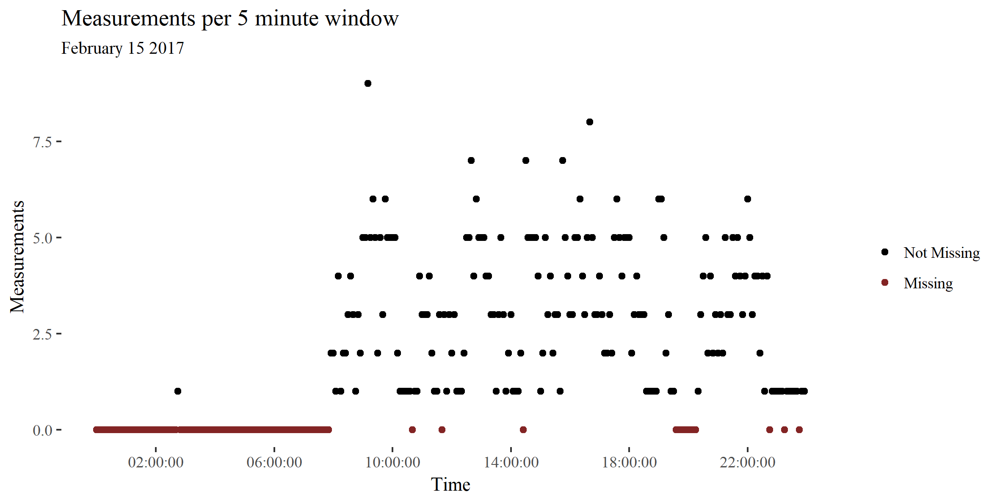
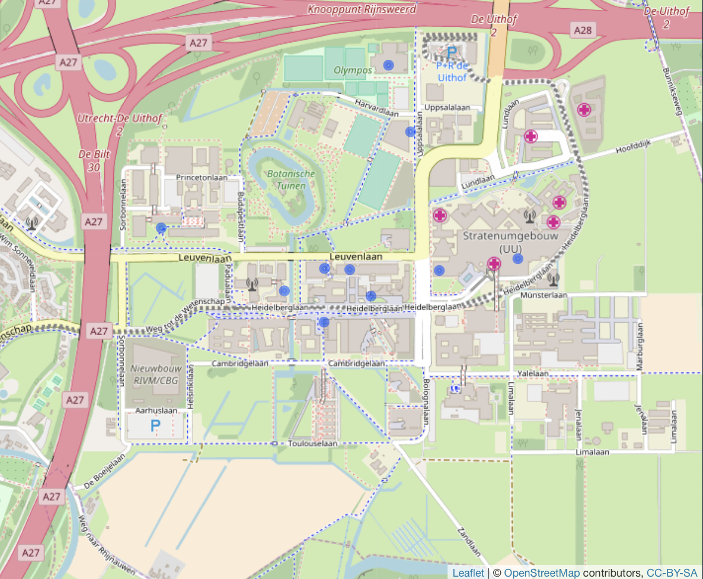
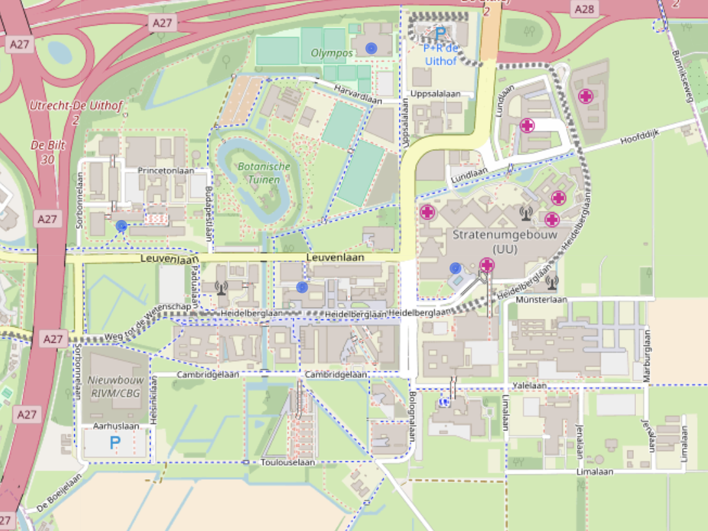
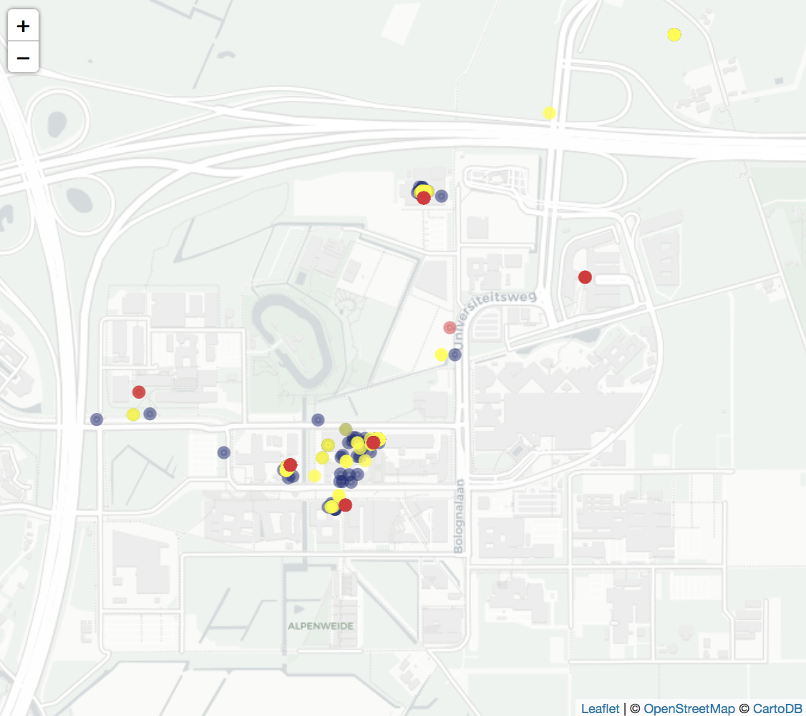
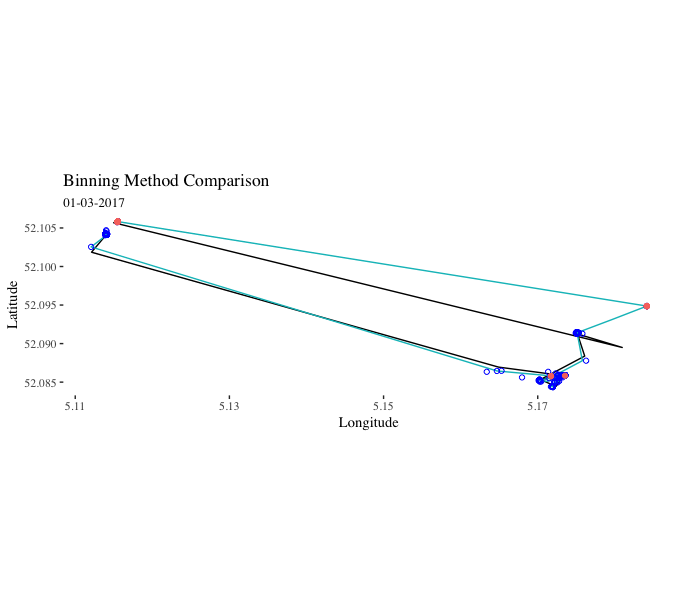
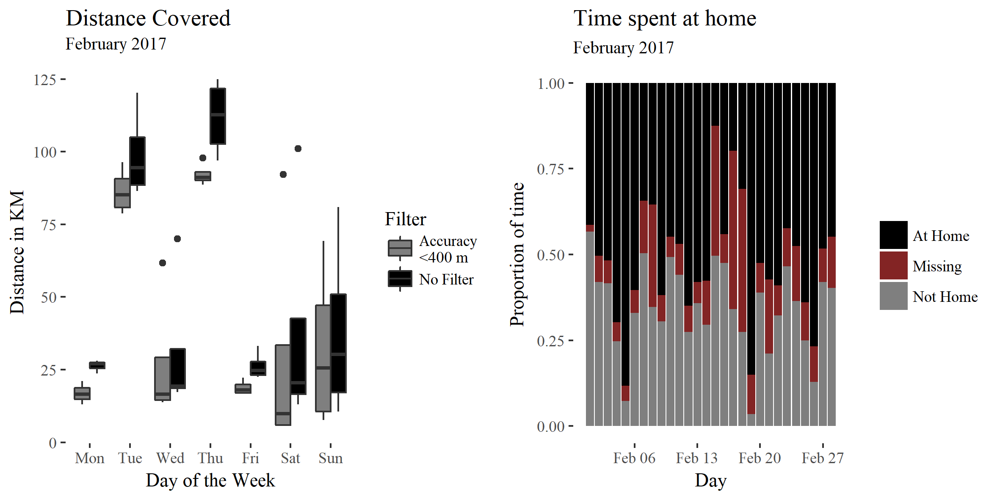

```{r setup, include=FALSE}
knitr::opts_chunk$set(echo = TRUE, cache = TRUE)
library(ggthemes)
library(ggplot2)
library(knitr)
```

# Abstract
*Personal mobility, or how people move in their environment, is associated with a vast range of behavioural traits and outcomes, such as socioeconomic status, personality and mental health. The widespread adoption of location-sensor equipped smartphones has generated a wealth of objective personal mobility data. Nonetheless, smartphone collected personal mobility data has remained underutilised in behavioural research, partly due to the practical difficulties associated with obtaining the data and partly because of the methodological complexity associated with analysing it. Recent changes in European regulation have made it easier for researchers to obtain this data, but the methodological difficulties remain. The difficulty lies in that smartphone location data is irregularly sampled, sparse and often inaccurate.  This results in a high proportion of missing data and significant noise. In this paper we present a method called Personal Map Matched Imputation (PPMI) to deal with missing data and noise in smartphone location logs. The main innovation of PPMI is that it creates a personalised spatial map for each individual based on all the available data. In doing so PPMI leverages the regularity of human mobility in order to smoothen noisy measurments and impute missing data values. By simulating missing periods in real data we find that a simple implementation of PPMI performs as well as existing methods for short (5 minute) missing intervals and substantially better for longer (1 day) missing intervals. When imputing a subset of real  missing data where travel logs are available as a reference points, we find that PPMI performs substantially better than existing models.*

# Introduction

Why is human mobility important? How people move about in their environment affects a wide range of outcomes, such as health, income and social capital [@goodchild_toward_2010]. Therefore it is unsurprising that policymakers and social scientists in numerous fields are interested in human mobility measures. The most widely administered personality questionnaires ask individuals to what extent they agree with statements such as "I love large parties", "I prefer going to the movies to watching videos at home" and "I love to travel to places that I have never been before" [@ipip]. Economists study geographic labour mobility extensively [e.g. @tatsiramos] and the European Commission considers labour mobility important enough to warrant its own directorate [@europeanComission]. Researchers have found that mobility measures can be used to predict academic performance [@wang_smartgpa:_2015], the incidence of obesity [@zenk_how_2009] or even the onset of a depressive epsiode in bipolar depression patients [@palmius_detecting_2017]. Indeed, within psychology when studying behavioural differences within individuals it has been often been neglected that individuals vary not only over time but also over space. To fully understand behaviour we must understand how behaviour can vary accross environments.

Despite their importance, a large part of studies on human mobility are conducted with pen-and-paper travel diaries. Pen-and-paper diares have well-known methodological flaws. For instance, they are expensive to collect and present a high burden to respondents. This limits the duration of data collection and the span of the log accordingly. Another issue is that they rely on self-reported measures. It has been reported that short trips are frequently under-reported  [@wolf_impact_2003] and the self-reported duration of commutes is often underestimated [@delclos-alio_keeping_2017]. These obstacles can be overcome by using objective data on human mobility. Such data  can now be obtained using the Global Positioning System (GPS). GPS uses the distance between a device and several satellites to determine location. GPS measurements can be used to infer a vast range of socioeconomic and behavioural measures, including where the individual lives, how much time he or she spends at home and where (and how) they travel.

However, not all GPS measurements are made equal. It is useful to classify GPS logs into different categories depending on their origin because different types of logs pose different methodological problems. We argue that social science researchers should explore using automatically collected smartphone GPS logs.  In most studies participants receive a specialised GPS devices to track their movement. We call resulting logs *specialised logs*. @barnett_inferring_2016 point out several methodological issues with these studies. Collecting specialised logs is costly and places a high burden on participants. Besides, introducing a new device to the participant's life may bias their behaviour. Due to these drawbacks specialised logs usually span a short amount of time. @barnett_inferring_2016 advocate installing a custom-made tracking app on user's phones (*custom logs*). The problem with this is that researchers have to develop a custom-made app, distribute it among research participants and enforce participation. Participants tend not to like these tracking apps because they drain the battery of the device. Another solution is to take advantage of existing smartphone location logs  (*secondary logs*) . For instance,  Google Location History contains information on millions of users [@location_history_timeline_2017]. Often, secondary logs span several years. By law, secondary logs are accessible to users for free [@commission_protecting_2017]. Yet, secondary logs also present methodological challenges. They were created for non-academic purposes under engineering constraints ( these constraints will be detailed subsequently). These constraints mean that sensors do not track users continuously, meaning that the resulting logs can be sparse and inaccurate. Hence, two important challenges are dealing with missing data and measurement noise.

| Feature        | Specialised Logs           | Custom logs  | Secondary logs |
| ------------- |:-------------:| -----:| -----:|
| Sampling Frequency | Regular | Regular |  Irregular |
| Sampling Frequency (Hz) | 0.1>      | Between 0.1 and 0.01| <0.01 |
| Typical Duration | 7 days    |    7-14 days | Years |
| Typical Accuracy Variance | Low    |    Medium | High |

In order to work with secondary logs, researchers need to be able to handle the data sparcity that leads to missing data. Missing data is a pervasive issue in secondary logs as it can arise due to several reasons. Technical reasons include signal loss, battery failure and device failure. Behavioural reasons include leaving the phone at home or switching the device off. As a result, secondary logs often contain wide temporal gaps with no measurements. For instance, several research groups studying mental health report missing data rates between 30% to 50% [@saeb_mobile_2015;@grunerbl_smartphone-based_2015;@palmius_detecting_2017]. Other researchers report similar trends in different fields [e.g. @harari_using_2016;@jankowska_framework_2015]. In Figure \@ref(fig:longMeasurementsPerDay) shows that despite the long duration of the log the sparcity it is also evident. 

```{r, longMeasurementsPerDay,echo = FALSE,fig.cap="Example of missing data over the entire duration of a secondary log. The x-axis denotes time, the y-axis shows how many measurements are made and each point is a five minute window. For this day there were several periods with no information. These points are filled with red and lie on the x-axis.",out.width = '100%'}


```

There is no golden standard for dealing with missing data in GPS logs [@barnett_inferring_2016]. Importantly, spatiotemporal data measurements are autocorrelated in both time and space. This means that common methods, such as mean imputation, are unsuitable.  For example, imagine an individual who splits almost all her time between work and home. Suppose she spends a small amount of time commuting between the two along a circular path. Using mean imputation to estimate her missing coordinates, we impute her to be at the midpoint between home and work.  She has never and will never be there! Worryingly, there is little transparency on how researchers deal with missing data [ @jankowska_framework_2015].

Another methodological problem is related to the noise in the measurements that are collected. The accuracy of smartphone location measurements is substantially lower than that of professional GPS trackers. Android phones collect location information through a variety of methods. Other than GPS measurements, Androids use less-accurate heuristics such as WiFi access points and cellphone triangulation. Different methods are used because of computational and battery constraints. GPS is the most energy consuming sensor on most smartphones [@lamarca_place_2005; @chen_practical_2006]. In professional GPS trackers less than 80% of measurements fall within 10 meters of the true location. GPS measures are most inaccurate in dense urban locations and indoors [@schipperijn_dynamic_2014;@duncan_portable_2013]. Unfortunately for researchers, this is where people in the developed world spend most of their time.

Google location history provides a measure of accuracy that is given in meters such that it represents the radius of a 67% confidence circle. @palmius_detecting_2017 note that in their Android based custom logs inaccurate location values are interspersed between more accurate location values at higher sample rates per hour. \@ref(fig:accuracyPlot) shows how accuracy can vary as a function of user behaviour, time and location. Inaccurate measures are often followed by more accurate measures.  Most notably, low accuracy often (but not always) is  associated with movement (\@ref(fig:accuracyPlot2)). Stationary accuracy varies depending on phone battery level, wifi connection and user phone use. There are several recurring low-accuracy points, possibly the result of cell-phone tower triangulation. 

```{r, accuracyPlot,echo = FALSE,fig.cap="Measurement accuracy of each logged measurement of a morning journey on February 15th 2017. This includes all measurements from midnight to midday. The red circles denote the accuracy of all logged measurement points (the raw data). The points connected in time are connected by a line. The blue line shows the path without the most inaccurate (accuracy > 400 meters) points filtered out. The red line shows the path with all measurements included. ",out.width = '100%'}
include_graphics("img/journeyTillMiddayBoaz.png")
```


```{r, accuracyPlot2, echo=FALSE, fig.cap="Measures of user activity and measurement accuracy on February 15th 2017.The upper chart shows the distance from the next measured point in meters over the course of the day. All journeys are marked with a red line. The first peak corresponds to the first journey from the user's home to a gym around 8am. The second, smaller peak before 10 reflects a journey from the gym to the nearby lecture theatre. Both journeys can be seen in Figure 1. All other journeys are not shown in Figure 1. The large jump between journey 5 and 6 is measurement error. The lower chart shows the accuracy over the course of the day. The figure shows that measurement inaccuracy is sometimes related to the movement of the individual.",out.width = '100%'}
include_graphics("img/accuracyLocShift.png")

```


Noisy data can lead to inaccurate conclusions if it is not accounted for. Suppose we wish to calculate an individual's movement in a day. A simple approach would be to calculate the sum of the distance between each measurement. But if there is noise, the coordinates will vary even though the individual is not moving. This is known as data drift (REFERENCE). If the measurements are frequent and noisy, we will calculate a lot of movement, even if the individual did not move at all! This issue is also visualised in Figure 1. The problem is further complicated because missing data and noisy measurements are related. Methods used by researchers to reduce noise, such as throwing out inaccurate measurements [e.g. @palmius_detecting_2017],  can exacerbate the severity of the missing data problem.

This paper wishes to achieve four objectives: First, we have argued that understanding human mobility is important. Secondly, we argued that social scientists should leverage data logs from smartphones to study human mobility, instead of relying on out-dated pen-and-paper questionnaires. Third, explained the practical difficulties in using smartphone location logs. In the following sections we would like to introduce Personal Map Matched Imputation (PPMI), a method for surmounting these difficulties. We will compare PPMI to existing methods in the literature.  

# Related Work

This section aims to explore related work with regard to missing data in GPS logs. We will argue three points. First, there is a lack of established practices to follow with respect to missing data in human mobility logs. Second, extensively used spatiotemporal methods, such as state space models (SSMs), are not well suited to deal with human mobility patterns in secondary logs. Third, we discuss in detail three approaches which deal explicitly with mobility patterns from custom or secondary logs [ @palmius_detecting_2017 ;@barnett_inferring_2016; **WU**].

How have researchers dealt with missing data in GPS-based human mobility logs thus far? Unfortunately there is no golden standard in how to deal with this type of missing data. Researchers are generally vague about what practices they follow [@jankowska_framework_2015]. Ostensibly this is because they are unaware of possible solutions. Often researchers simply downsample and remove missing observations or use some sort of rule-based common sense imputations (e.g. @palmius_detecting_2017). The only principled approach that we know of that aims to solve the issue of missing data in GPS logs as they relate to human mobility is of @barnett_inferring_2016. Both of these methods will be detailed subsequently, after introducing exploring other spatiotemporal methods.

A lack in methods for missing data imputation for human mobility patterns does not imply there is not a vast literature on modelling movement. The most widespread models are SSMs, therefore we shall detail a few examples and subsequently argue that they are nonetheless unsuited for long term human mobility logs. Ecologists have used SSMs to explain how animals interact with their environment [@patterson_statespace_2008]. These models can be quite complex. @preisler_modeling_2004 uses Markovian movement processes to characterise the effect of roads, food patches and streams on cyclical elk movements. The most well studied SSM is the Kalman filter, which is the optimal algorithm for inferring linear Gaussian systems. The extended Kalman filter is the de facto standard for GPS navigation [@chen_state_2013]. The advantage of state space models is that they are flexible, deal with measurement inaccuracy, include information from different sources and can be used in real time.

For secondary logs the main limitation of SSM implementations is that they ignore movement routines.  For instance, humans tend to go to work on weekdays and sleep at night. Because SSMs are based on the Markov property, they cannot incorporate this information. In other words, the estimated location $G(t)$ at timepoint $t$ is often based only upon measurements $D_t$, $D_{t-1}$ and ignores all $D_{t-i}|i\geq2$. Hierarchical structuring and conditioning on a larger context have been suggested as ways to add periodicity to Markovian models. These solutions are often computationally intractable or unfeasible [@sadilek_far_2016]. Moreover, these models often assume time and space invariance, assumptions which are violated in the case of human movement patterns. For this reason we do not consider SSMs to be useful for imputing missing data in this case. 

In the wider realm of spatiotemporal statistics there are numerous missing data imputation methods. These often come from climate or geological research and rely on spatiotemporal autocorrelations. For instance, the CUTOFF method estimates missing values using the nearest observed neighbours [ @feng_cutoff:_2014 ]. The authors illustrate their example using rainfall data from gauging stations across Australia. Similarly, @zhang_application_2017 use a variety of machine learning methods to impute missing values. The example provided relates to underground water data. Generally these models assume fixed measurement stations (such as rainfall gauging stations). For this reason they cannot be easily applied to missing mobility tracks without significant pre-processing.

On the other hand, a few researchers have explicitly attempted to impute missing data from human mobility patterns [ @palmius_detecting_2017 ;@barnett_inferring_2016; **WU**]. Importantly, none of them worked with secondary logs. Nonetheless we will detail what they did as informative examples. @palmius_detecting_2017 deal with the measuremement inaccuracy of $D$ in custom logs by removing from the data set all unique low-accuracy $a$ data points that had  $\frac{d}{dt}D > 100 \frac{km}{h}$. Subsequently the researchers down sample the data to a sample rate of 12 per hour using a median filter. Moreover, @palmius_detecting_2017 explain:

>"If the standard deviation of [$D$] in both latitude and longitude within a 1 h epoch was less than 0.01 km, then all samples within the hour were set to the mean value of the recorded data, otherwise a 5 min median filter window was applied to the recorded latitude and longitude in the epoch".

Missing data was imputed using the mean of measurements close in time if the participant was recorded within 500m of either end of a missing section and the missing section had a length of $\leq 2h$ or $\leq 12h$ after 9pm. 

@barnett_inferring_2016 follow a different approach which is, to the best of our knowledge, the only pricipled approach to dealing with missing data in human mobility data. @barnett_inferring_2016 work with custom logs where location is measured for 2 minutes and subsequently not measured for 10 minutes. In the words of the authors, @barnett_inferring_2016 handle missing data by:

> "simulat[ing] flights and pauses over the period of missingness where the direction,
duration, and spatial length of each flight, the fraction of flights versus the fraction of
pauses, and the duration of pauses are sampled from observed data."

This method can be extended to imputing the data based on temporally, spatially or periodically close flights and pauses. In other words, for a given missing period, the individual's mobility can be estimated based on measured movements in that area, at that point in time or movements in the last 24 hours (*circadian proximity*).

On the other hand, **Wu 2017** use what they call a Spatial Temporal Semantic Neural Network to predict future human movement. While the authors are concerned with prediction and not imputation, they devised an algorithm called the Spatial Temporal Semantic algorithm converts raw measurements to machine learning friendly discrete bins. This minimises the measurement error and paves the way for applying machine learning methods to human mobility problems.

# Methodology

## Notation

GPS measurements provide us with coordinates on the surface of the earth, which is ellipsoid shaped. Projecting three dimensional measurements in $\mathbb{R}^3$ onto a two dimensional plane in $\mathbb{R}^2$ results in distortion. For clarity, when we use the term distance we refer to the geodesic distances on an ellipsoid using the WGS84 ellipsoid parameters.

Subsequently let us simplify by assuming that a persons location is on two-dimensional Euclidian plane. Let a person's true location on this two-dimensional plane be $G(t) = [G_x(t) G_y(t)]$ where $G_x(t)$ and $G_y(t)$ denote the location of the individual at time $t$ on the x-axis and y-axis respectively. Moreover, let $D \in \mathbb{R}^2$ be the recorded data containing lattitude and longitude. In addition, let $a$ denote the estimated accuracy of the recorded data. Furthermore, $G(t)$, $D$ and $a$ are indexed by time labled by the countable set $t = t_1 < ... < t_{n+1}$. The measure of accuracy $a_t$ is given in meters such that it represents the radius of a 67% confidence circle. If $D_t = \emptyset$ it is considered *missing* and it is not missing otherwise. 

When several data sets are available from individuals living in overlapping areas we can construct a $t \times i$ matrix $M$ where the entry $M(t,i)$ contains $G(t)$ for the individual $i$.

### MYMETHOD algorithm

Our algorithm is designed to leverage the periodic nature of human movement along with the long span of the data to deal with measurement sparcity and inaccuracy.  

#### Modelling assumptions

First, following @barnett_inferring_2016 we categorise all timepoints $t$ as either belonging to the set $P$ (pause) or set $F$ (flight). Conceptually pauses can be understood as periods of time where an individual spends singificant amount of continous time without moving. Flights are the times where the individual is moving. Let $t_a$ be a pause of length $n$.
$$t_a = t_i < ... < t_{i+n}$$
Let $t_b$ be a pause of length $m$ such that there is no temporal overlap between $t_a$ and $t_b$:
$$t_b = t_j= < ... < t_{j+m}|t_{i+n}< t_j$$
Then it follows that between the two pauses there must be a flight indexed by $t_x$ of length $j-i+n$.
$$t_x =  t_{i+n} < ... < t_{j} |t_x \in F$$
We define pause locations $G(t_a), G(t_b) | t_a, t_b \in P$ as locations where an individual spends an extended amount of time in the same space (e.g. school, home, work, train station, barber shop, bar, gym). Importantly, our model assumes period and cyclic human movement such that there are many pauses $t_{a1},t_{a2},...,t_{an}$ such that $G(t_{a1}) = G(t_{a2}) = ... = G(t_{an})$. Moreover,it is possible for $G(t_a) = G(t_b)$ such that $t_a \ne t_b$. For example, if the individual leaves home for a run and returns home without stopping anywhere else. 

Let us define as $Flight^x_{ab}$ the set of all points belonging to a flight between $G(t_a)$ and $G(t_b)$ at timepoint $t_x$.
$$Flight^x_{ab}= G(t_x)|t_x \in F =  \{G(t_{i+n}),...,G(t_j)\}$$
Again, there are many flights $t_{x1},t_{x2},...,t_{xn}$ such that $Flight^{x1}_{ab} = Flight^{x2}_{ab}  = ... = Flight^{xn}_{ab}$. Then, we can define as $Path_{ab}$ the set of all flights between $G(t_a)$ and $G(t_b)$ at all timepoints. For simplicity, we assume that $Path_{ab}=Path_{ba}$.

In addition, we consider all measurements $D(t)$ to be imperfect measurements of $G(t)$:

$$ G(t) = D(t) + \text{Measurement Error}  $$

### MYMETHOD algorithm

Our algorithm performs the following steps:

1. Extract from measurements $D$ all pause locations and path clusters. Following **Wu 2017 (NOTE: ADD REFERENCE)** we use a modified spatial-temporal-semantic (STS) feature extraction algorithm to transform pause and path locations into machine learning friendly discrete location sequences.
2. Assign each measurement $D$ to a unique discrete location. 
3. Use neural networks to predict missing measurements based on the time as well as the distance in time to the next and previous measurements. 

In this paper we have chosen relatively simple functions as component functions of MYMETHOD. It is clear each of them can be improved. We aim to illustrate not the efficacy of the components themselves but rather how they can work together to impute missing data. 

#### Extract pause locations

There are multiple ways of extracting pause locations in the literature (**examples & citations needed: see Wu 2017**). As far as we know there are only two methods which explicitly with mobility patterns from unevenly sampled smartphone logs [ @palmius_detecting_2017 ;@barnett_inferring_2016]. Both of these processes pre-process the data and subsequently use two steps to extract pause locations: first they extract pauses and their corresponding locations, then they cluster pause locations based on spatial proximity. In particular, @barnett_inferring_2016 use a version of @rhee_human_2007's rectangular method to classify pauses and determine flight sub-sections. MYMETHOD uses a stricter version of @barnett_inferring_2016's approach to extract pauses.

First the measurements $D$ are filtered such that only measurements with an accuracy value lower than $a_{\text{P lim}}$ remain within the sample. Then, a measurement $D_t$ belongs to a pause if and only if:

1. The next measurement $D_{t+1}$ is within $t_{\text{Pause lim}}$ amount of seconds (so it is not missing)
2. The next measurement $D_{t+1}$ is within $d_{\text{Pause lim}}$ meters.
3. The duration of the pause is more than $\delta_{\text{Pause lim}}$ seconds.
4. Let the points of a possible pause which fit the aforementioned criteria be $D_{t,t+1,...,t+n}$. These points are only a pause if the distance between the mean coordinates of $D_{t,t+1,...,t+n}$ and the furthest away points of $D_{t,t+1,...,t+n}$ is within 2 times the mean accuracy $a$ of $D_{t,t+1,...,t+n}$.

This set of points were then hierarchically clustered using a distance matrix, such that all points within $d$ meters of each other were clustered into a pause location. Each pause location is a cluster. 

#### Extract paths

To extract path clusters we apply a modified version of the spatial-temporal-semantic (STS) feature extraction presented in **Wu 2017 (NOTE: ADD REFERENCE)**.

The key modification is that whilst **Wu 2017 (NOTE: ADD REFERENCE)** use map matching as a ground truth to assign noisy measurements into discrete bins along paths, we use the total mobility history of the individual to do so. This leverages the periodic nature of human movement as well as the long span of secondary logs. Therefore we consider each measurement at $D_x$ as a sample of $Path_{ab}$. In practice, for each observed path, MYMETHOD uses the following algorithm to estimate $Path_{ab}$:

1. Take all measurements which are not pauses, filter them based on an accuracy threshold $a_{\text{Path Lim}}$.
2. Create a distance matrix for each point and hierachically cluster it accordingly, such that all points within $d_{\text{Path Lim}}$ meters of each other are clustered into a single pause point.

At this point all empirically observed path clusters and pause clusters are extracted. However, there may be some overlap between pause clusters and path clusters. Thus, the clusters are clustered again, such that the pause clusters retain priority. This means that if a pause cluster and a path cluster are within less than $d$ meters of each other, the path cluster was removed. The reasoning for this is twofold: first, that the threshold for not being in a pause cluster should be higher, as individuals spend the majority of time at a pause cluster. Secondly, due to data drift it can often appear that there is movement when there is none.The end result is a discretised map which contains pause and flight clusters based on the history of the individual.

Subsequently, all measurements $D$ were are then assigned to a discrete cluster. We used a simple assigning function, whereby the measurements where assigned to the cluster nearest to the measurement. We shall discuss the merits of choosing a more sophisticated assigning function subsequently.

#### Neural network

An artificial neural network was trained to predict the missing values. The input variables to the neural net are:

1. The previous and subsequent observed cluster.
2. The distance in time to the next & previous cluster.
3. The time of the day encoded as a cyclical two-dimensional feature **NOTE: add reference**
4. The day of the month encoded as a cyclical two-dimensional feature **NOTE: add reference**
5. The month of the year as a binary class matrix.

For more information on the precise architecture of the artificial neural network please consult the appendix.

For a missing timepoint at $D_t$, the output of the model is a set of probability estimates associated with every location cluster. That is, for each missing timepoint the model returns a vector of probability estimates (with one estimate per cluster) associated with where the individual is. 

### Datasets & Analyses

The data used to train the imputation methods was collected between 2013 and 2017 on different Android devices from several individuals (table 1).

```{r datadetailsTable, echo = F, eval = F}
datadetails <- readRDS("tempdata/datadescriptives.rds")
datadetails <- datadetails[,-7] #remove last column for now
kable(datadetails,digits = 2,col.names = c("Log duration",
                                           "Logged days",
                                           "Observations",
                                           "Missing days",
                                           "Missing data",
                                           "Mean Accuracy"),
      caption = "Table with descriptives about the data sets used to build the imputation methods. Missing data stands for the proportion of missing 5 minute windows within days that were not missing entirely.")
```

Analyses were performed using R and a multitude of other statistical packages [@base;@ggplot2;@dplyr;@sp1;@sp2]. **add packages**

### Results & Evaluation Metrics

The results will consist of multiple steps:

1. A descriptive documentation of the characteristics of missingness in secondary logs.
2. Evaluating the performance of the modified STS algorithm in extracting paths as well as two rival methods.
3. Comparing the performance of MYMETHOD using a) baseline models b) performance with randomly removed data in comparison to the aforementioned methods [@palmius_detecting_2017; @barnett_inferring_2016] and c) objective ground-truth data.

#### Missingness

With respect to the characteristics of missingness we will report how often data is missing and whether missingness displays temporal or spatial patterns.

#### Binning evaluation

In order to evalute the modified STS algorithm we will first visually evaluate the paths and pause locations. A visual evaluation of paths is an established way to heuristically check their accuracy (*add reference*). Then, let the average distance between the actual measured point and the binned point be the *deviation distance* $d$. With respect to the deviation distance, we expect:

1. A positive relationship between the deviation distance and the accuracy of each measurement.
2. Roughly 67% of the deviation distances $d$ are within accuracy $a$ of each measurement.

#### Imputation algorithm performance

We treat missing data imputation as a classification problem, taking 25% of all measurements at random and eliminating them from the sample, recalculating features and computing classification accuracy. Moreover, we evaluate the performance of the imputation algorithm for the entire duration of the log with in comparison to a naive baseline models where for each missing period we predict the prevous non-missing cluster.

To compare the performance of the different missing data imputation algorithms we will remove 25% of measured time intervals at random within a four week period. We will make our comparisons for intervals of 5 minutes, 1 hour and 1 day. In other words, we will remove 25% of time intervals at random, while varying the size of the time intervals removed.

To compare all methods with each other we will compute a distance measure (how far was the removed location from the predicted location). For MYMETHOD's imputations we will use a weighted mean for the distance measures whereby each 5 minute period is weighted equally. This is necessary because Barnett's and Palmius' model estimate far fewer values than MYMETHOD. While Barnett's and Palmius' models estimate 12 measurements for each missing hour, MYMETHOD estimates as many measurements as there are in the sample. When individuals go to unfrequently travelled locations they tend to look use their phone's location services more, which leads to more measurements, hence more imputed values. Hence, if the weights are not used MYMETHOD is succeptible to error overestimates which are related to measurement frequency in a way that the other two methods are not. 

In addition, other measures we will report for MYMETHOD are accuracy (in what percentage of the cases was the appropriate cluster predicted) and the expected distance. The expected distance is the crossproduct of the estimated probabilities that the individual is at a given cluster and the distances between the clusters to the true cluster. For example, if the true location of an individual is cluster A (cluster A is 10 meters away from cluster B) and the model assigns a probability of 0.9 at cluster A and 0.1 at cluster B, then the expected distance would be 1 meter. 

Finally, we will take objective real world data and compare it to predicted values. We will use information from the Dutch public transportation card, which provides users with timestamped data of when and where they board, change lines or leave public transportation.

## Results

### A descriptive documentation of the characteristics of missingness

This is an example of a smartphone secondary log. About 54% of the data is missing for the entire duration of the log. This may be misleading as there are several long periods with no measurements whatsoever (see Figure \@ref(fig:longMeasurementsPerDay)). For days which were not entirely missing, approximately 22% of all five minute segments were missing. The structure of missingness of a day with measurements is shown in Figure \@ref(fig:measurementsPerDay). As you can see, there are several long periods over the course of the log for which there are no measurements. Moreover, even during a single day there are continuous periods where there is missing data, mostly during the late hours of the night in this case. The median sampling frequency per day for non-missing days is around 0.006 Hz.

```{r, measurementsPerDay,echo = FALSE,fig.cap="Example of missing data on February 15th 2017. The x-axis denotes time, the y-axis shows how many measurements are made and each point is a five minute window. For this day there were several periods with no information. These points are filled with red and lie on the x-axis.",out.width = '100%'}
#fix width
include_graphics("img/missingdayBoaz5min.png")

```


### Modified STS performance in comparison to other binning methods

Before we can evaluate the model, it is essential to evaluate how the noisy data has been restructured. Without this evaluation model accuracy measures could be misleading, as a good performance may simply be modelling noise. Therefore we will assess the performance of the modified STS binning method and compare it to alternatives.

We used the following parameters to extract pauses: an accuracy limit $a_{\text{Pause lim}}$ of 250 meters, a time limit $t_{\text{Pause lim}}$ of 300 seconds, a distance limit of $d_{\text{Pause lim}}$ 50 meters and a minimum pause duration limit $\delta_{\text{Pause lim}}$ of 100 seconds. Moreover, to extract path clusters we used the parameters: $a_{\text{Path Lim}} = 150  \text{meters}$ and $d_{\text{Path Lim}} =300  \text{meters}$.

Importantly, we did not use the entire length of the log, but rather only the time periods when the individual was in the Netherlands. This was done to reduce computation time. 

When selecting parameters there is a trade off is between resolution and accuracy. This is because an increase in resolution comes at the expense of accuracy. For instance, by increasing the clustering distance parameter $d_{\text{Pause lim}}$ we can extract more valid pause locations at the expense of falsely categorising certain measurements to the wrong cluster. This is illustrated in Figures \@ref(fig:pauseLocUithof1) and \@ref(fig:pauseLocUithof2).

```{r, pauseLocUithof1,echo = FALSE,fig.cap="Example of pause locations in De Uithof using 150 meters and 400 meters as clustering parameters respectively.",out.width = '100%'}
#fix width

```

```{r, pauseLocUithof2,echo = FALSE,fig.cap="Example of pause locations in De Uithof using 150 meters and 400 meters as clustering parameters respectively.",out.width = '100%'}

```


The end result of step 3 of MYMETHOD results in a personalised map with pause and path clusters. An excerpt can be seen in Figure \@ref(fig:mapClusterMap). As expected, MYMETHODs path extraction yields greater accuracy for frequently ocurring paths. It is important to remind the reader that despite the close overlap with features on the map,  such as roads and railway lines, MYMETHOD is map agnostic and uses no information from the map to recreate these features.

```{r, mapClusterMap,echo = FALSE,fig.cap="Excerpt of the cluster map if an individual. Red points are pause locations, blue points are path locations.",out.width = '100%'}
#fix width
include_graphics("img/mapClusterMap.png")
```

For the entire period when the individual is in the Netherlands, there is a mean deviance of 40 meters and a median deviance of 15 meters. Around 69% of the deviance values are within their corresponding accuracy value, which is close to the theoretical $\frac{2}{3}$ value that is expected. 

For the narrower period of March 2017, figure \@ref(fig:devianceComp) illustrates the relationship between the deviance and accuracy. Approximately 74% of the deviance values are within their corresponding accuracy values, which is close to the theoretical $\frac{2}{3}$ value that is expected. The mean and median deviance are 38 and 14 meters respectively. 

```{r, devianceComp,echo = FALSE,fig.cap="Excerpt. MISSING CAPTION HERE",out.width = '100%'}
#fix width
# add figure with deviance comparisons three columns each method once
```

In comparison, Palmius' method has a median deviance of 3 meters, with a mean of 115 due to high deviance outliers. Over 90% of deviance values are within accuracy, which suggests that the model is binning noise. In Figure \@ref(fig:palmiusVme) the key difference is visible. The Palmius method is much more sensitive to inaccurate values, such as the one at the top right of the figure. 

On the other hand, Barnett's method has mean deviance of 343 meters and a median deviance of 8 meters. Barnett's deviance is neccessarily higher than Palmius', as they downsample and subsequently aggregate into pauses and linear flights. 

```{r, palmiusVsMe1,echo = FALSE,fig.cap="Excerpt. MISSING CAPTION HERE",out.width = '100%'}
#fix width

```

```{r, palmiusVsMe2,echo = FALSE,fig.cap="Excerpt. MISSING CAPTION HERE",out.width = '100%'}

```


### Comparison to alternative models

```{r,resulttable, echo = F}
library(knitr)
library(kableExtra)


resultsDf <- data.frame( mean5min = c(82,43,269,426),
                         median5min = c(4,0,0,0),
                         meanexpDist5min = c(NA,NA,414,NA),
                         medianexpDist5min = c(NA,NA,0,NA),
                         mean1hr = c(345,497,908,1502),
                         median1hr = c(6,4,0,0),
                         meanexpDist1hour = c(NA,NA,916, NA),
                         medianexpDis1hour = c(NA,NA,0, NA),
                         mean1day = c(9273,NA,5757,14266),
                         median1day = c(12,NA,0,1288),
                         meanexpDist1Day = c(NA,NA,5757, NA),
                         medianexpDis1Day = c(NA,NA,0, NA))

rownames(resultsDf) <- c("Barnett & Onella", "Palmius", "Sobrado","Naive")
colnames(resultsDf) <- c("Mean","Median","Expected Mean","Expected Median",
                         "Mean","Median","Expected Mean","Expected Median",
                         "Mean","Median","Expected Mean","Expected Median")

# median 12 meters mean 9273
library(knitr)
library(kableExtra)
options(knitr.kable.NA = '-')
kable(resultsDf, "html") %>%
  kable_styling("striped") %>%
  add_header_above(c(" " = 1, "Five Minutes" = 4, "One Hour" = 4,"One Day" = 4))

```


In terms of coverage, it is important to note that the Palmius model failed to impute 3% of all removed values for both the 5 minute and over 10% for the 1 hour tests. Palmius' model failed to impute a single value for the day tests. Barnett's failed to impute 11% of the missing values. MYMETHOD made an imputation for all missing values.

As for MYMETHOD's accuracy in this period, the prediction accuracy was 88%, 73% and 47% for the 5 minute, 1 hour and 1 day periods respectively. As a comparison, the naive model's accuracy ratings were 87%, 68% and 24% respectively. 


### Comparison with objective data

The naive model reaches an accuracy of 16%, with a median distance of 555 meters and mean distance of 3303 meters. On the other hand MYMETHOD has an accuracy of 24%, with a median distance of 1037 meters and a median distance of 5637. The expected distance has a mean of 6432 and a median of 1037. 

Palmius's model failed to impute 38 out of 97 periods. For those it did impute, it showed a mean distance of 1517 meters and a median distance of 1617. Barnett's model failed to impute 18 out of 97 periods. For those it did impute, it had a mean of 5506 and a median of 1342.

### Effect on aggregate measures

Social scientists are most interested in aggregating spatiotemporal data to more socially relevant information, such as distance travelled. As we discussed earlier, aggregations without data processing can be highly biased. However, as an example we calculate time spent at home of the user for each day of the week in the month of February (\@ref(fig:aggrePlot)). Between individuals, time spent at home has been found to be a reliable predictor of extraversion [@harari_using_2016]. 

```{r, aggrePlot,echo = FALSE,fig.cap="Proportion of time spent at home in February 2017. We estimate this by calculating the mean lattitude and longitude for every 5 minute time period in the month. Missing values are filled in by the previous observed value. Behavioural trends are evident, the user spends more time at home on weekends than on weekdays. Moreover, the variance is greater on weekends, due to travel.",out.width = '100%'}

```

## Discussion

Overall the MYMETHOD performed well, although not substantially better than the naive model.  In addition, the comparison to the performance of the Barnett&Onella and Palmius models is somewhat unfair, as they were created for custom logs, not secondary logs. Nonetheless, the comparison remains valid as they are the closest we found to a missing data imputation.

In addition to higher accuracy under the conditions of secondary logs, the advantages of MYMETHOD are increased coverage and flexibility for missing data imputation, robustness to irregular sampling, the ability to model complex non-linear interactions in its imputations, and the ability to use historical records to smoothen movement noise.

MYMETHOD's increased coverage and flexibility comes from its ability to make complex non-linear predictions. For instance, in a given missing period it might make sense to predict that the individual is either at home, or at the office, or at a shop with equal probability. While MYMETHOD can make such an imputation, none of the alternative methods can do this. Moreover, the ability to take the prediction probability values from the neural network also helps in dealing with uncertainty. A known-drawback of single imputation is that it takes an imputed value and treats it as observed (*RUBIN*). Simple rule-based methods such as Palmius' are essentially algorithmic single imputation methods. With MYMETHOD it is possible to construct confidence intervals using the predicted probabilities of each estimate.

With respect to irregular sampling, alternative methods use temporally based downsampling in order to reduce noise. This leads to deterioration in resolution not only over space, but also over time. A combination of irregular sampling with the fluctuating accuracy values can lead to nonsensical results. For instance, consider a case where there are two inaccurate measurements in movement at 12:00:01 and 12:04:59. Downsampling over 5 minute periods will lead to a value that will be the mean of the two inaccurate samples, which is likely to be a location the individual is certainly not. MYMETHOD instead downsamples spatially, which ensures that the binned location is one which is composed of the mean of hundreds of observations.

While both @barnett_inferring_2016 and @palmius_detecting_2017 use historical data to smoothen pause locations by clustering pause locations with with a close degree of spatial proximity, neither of them do the same for paths. Hence all paths are calculated based on sensor input only. This may be feasible with high frequency regularly sampled short duration logs but creates noise with secondary logs. Moreover, with secondary logs it is feasible to spatially "average out" multiple samples of the same path in order to recreate it in its entirety. For instance, although the mean sampling frequency during train travels on the Amsterdam-Utrecht line is low (*report value here*) the personalised map manages to recreate the train line almost perfectly, despite being completely map agnostic.

There are multiple methodological limitations in this paper. Most importantly, the evaluation methods are imperfect. The golden standard would be to use at least one highly accurate professional grade GPS device with high sampling frequency to compare our data to. Until that is available, the use of public transport data and crossvalidation is just a substitute. 

Furthermore, MYMETHOD also has several limitations. The pause extracting function, the path clustering function, the classification model and the assignment function remain simplistic and could be improved. Indeed, our intention is not to develop an optimal classification model or any of the other components of MYMETHOD, but rather to show a new way in which secondary logs can be made useful by social scientists.

With regards to pause extraction, the probability of a pause at a given location is certainly related to other factors, such as the time of the day as well as the prior history of pauses at that location. These factors are not taken into account in the pause extraction function. Improved methods would do well to do so.

As for the path clustering function, a drawback of the current method is that the density of the clusters is a function of the clustering parameter $d$, the distance between the observed points and their sampling density. It does not take into account the length of the path as well as the average sampling frequency of the path. This is an issue because it can lead to clusters to which data points are seldomly assigned. For example, while the Amsterdam-Utrecht line has been mapped out almost perfectly, many of the clusters along the route have only been assigned few measurements. This leads to difficulties in the machine learning part of the model, as unfrequently observed clusters are hard for the model to predict.

Similarly, a limitation of the current assignment function is that it only takes into account the distance between the observed measurement and all the clusters when assigning each measurement to a cluster. It does not take into account any contextual information that can be gleaned from the entire movement history of the information, such as what path they are on. For instance, assume that it is known that an individual is travelling from point A to point B along path AB, and there is an inaccurate measurement closest to a cluster which belongs to path AC. By only taking distance into account, the measurement can get assigned to the wrong cluster on path AC. An improvement would be use a Bayesian method, whereby assignment is a function of both the measurement and the ANN model. This could take the form of a Kalman filter. In this case the state side of the model would represent a probabilistic representation of where the individual could be based on what the ANN has extracted from the individuals movement history. The space side of the model would be a measurement equation representing the measurement and the uncertainty surrounding it in the form of $a$.

As for the simplicity of the neural network which was used to generate predictions. A more sophisticated recurrant neural network (RNN), or a long short-term memory recurrant neural network (LSTM) would likely perform significantly better.

## Conclusion

Advantages of MYMETHOD:

1. Full imputation coverage.
2. Probability of cluster as measure of uncertainty.
3. Reduction of data drift through discretisation.
4. Robust to irregular sampling.
5. Few assumptions.

Disadvantages:

1. Weak in unfrequently sampled locations. Perhaps use alternative methods there (e.g. Kalman filter)
2. Some sacrifice of accuracy for consistency. See high vs low resolution pause maps. 

Further research:

1. More sophisticated pause/path extracted algorithms.
2. More sophisiticated ML models.
3. Introducing explicit assumptions about paths.
4. Run a study where individuals have a high frequency sampling high accuracy GPS receiver on them (test out of sample performance).
5. Path extraction for train stuff. 

*To do: add info on paragraphs and sections/subsections.*
