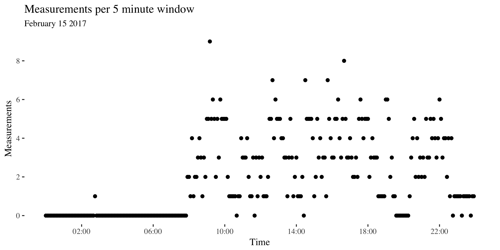
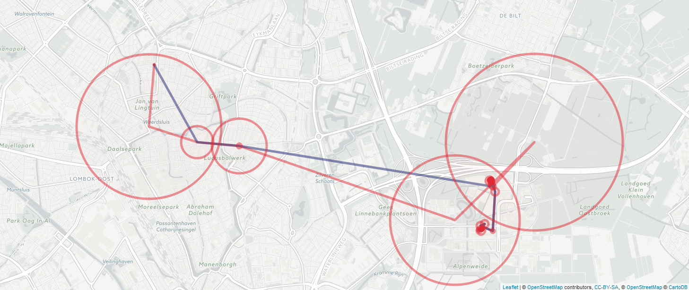
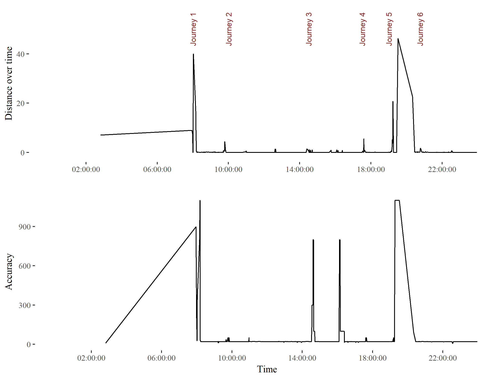
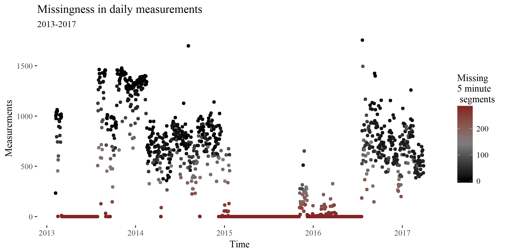
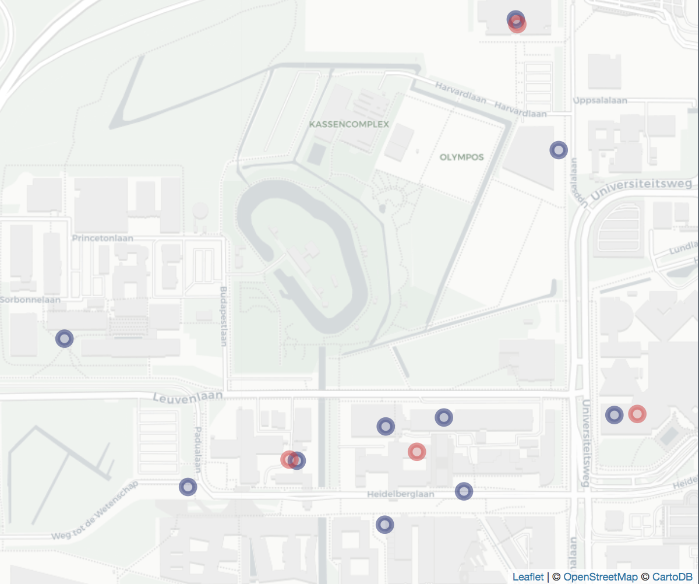
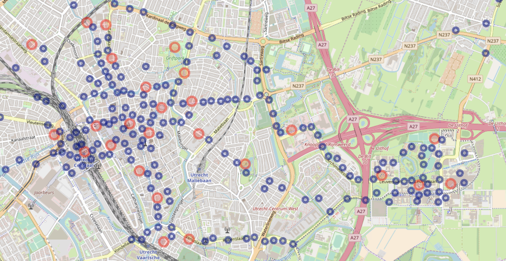
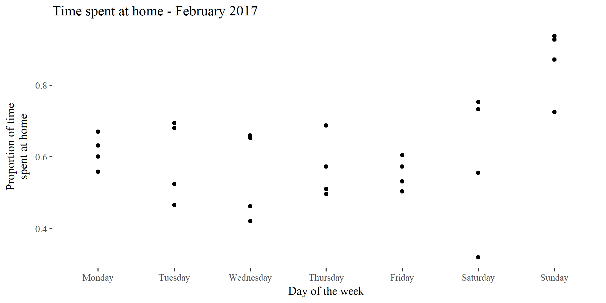

```{r setup, include=FALSE}
knitr::opts_chunk$set(echo = TRUE, cache = TRUE)
library(ggthemes)
library(ggplot2)
library(knitr)
```

# Abstract
*Personal mobility, or how people move in their environment, is associated with a vast range of behavioural traits and outcomes, such as socioeconomic status, personality and mental health. The widespread adoption of location-sensor equipped smartphones has generated a wealth of objective personal mobility data. Nonetheless, smartphone collected personal mobility data has remained underutilised in behavioural research, partly due to the practical difficulties associated with obtaining the data and partly because of the methodological complexity associated with analysing it. Recent changes in European regulation have made it easier for researchers to obtain this data, but the methodological difficulties remain. The difficulty lies in that smartphone location data is irregularly sampled, sparse and often inaccurate.  This results in a high proportion of missing data and significant noise. In this paper we present a method called Personal Map Matched Imputation (PPMI) to deal with missing data and noise in smartphone location logs. The main innovation of PPMI is that it creates a personalised spatial map for each individual based on all the available data. In doing so PPMI leverages the regularity of human mobility in order to smoothen noisy measurments and impute missing data values. By simulating missing periods in real data we find that a simple implementation of PPMI performs as well as existing methods for short (5 minute) missing intervals and substantially better for longer (1 day) missing intervals. When imputing a subset of real  missing data where travel logs are available as a reference points, we find that PPMI performs substantially better than existing models.*

# Introduction

Why is human mobility important? How people move about in their environment affects a wide range of outcomes, such as health, income and social capital [@goodchild_toward_2010]. Therefore it is unsurprising that social scientists in numerous fields and even policymakers are interested in human mobility measures. The most widely administered personality questionnaires ask individuals to what extent they agree with statements such as "I love large parties", "I prefer going to the movies to watching videos at home" and "I love to travel to places that I have never been before" [@ipip]. In economic research, the postal code of an individual's home address is often used as a proxy for socioeconomic status [e.g. @villanueva]. Moreover, economists study geographic labour mobility extensively [e.g. @tatsiramos]. In fact, the European Commission considers labour mobility important enough to warrant its own directorate [@europeanComission]. The extensive use of measures like these across different domains strongly suggests that mobility metrics are linked to real world outcomes. Perhaps it is unsurprising that behavioural researchers have found that mobility measures can be used to predict academic performance [@wang_smartgpa:_2015], the incidence of obesity [@zenk_how_2009] or even the onset of a depressive epsiode in bipolar depression patients [@palmius_detecting_2017]. Indeed, there is an argument to be made that perhaps psychologists have not been studying mobility enough. When studying behavioural differences within individuals behavioural scientists have often neglected the fact that individuals vary not only over time but also over space. To fully understand behaviour we must understand how behaviour can vary accross environments.

Despite the importance of mobility measures, the majority of these measures are obtained through the use of questionnaires (such as the IPIP) or specifically through pen-and-paper travel diaries. Questionnaires and travel diaries are have well-known methodological flaws: they are burdensome to collect and rely on accurate self-reporting. The burdensomeness stems from the fact that participans must be explicitly asked to report on their movement patterns at frequent intervals due to forgetfulness. This makes the data expensive to collect and limits the extent of data collection in practice. In addition, the frequent reporting duties of the participant may bias the participants behaviour. Participant forgetfulness also limits the accuracy of self reported measures. There is clear evidence that participants are systematically biased when self-reporting mobility measures. For instance, participants underreport the frequency of short trips [@wolf_impact_2003] and underestimate the duration of regular commutes [@delclos-alio_keeping_2017]. These obstacles can be overcome by using objective data on human mobility.

Social scientists now have the unprecedented opportunity to easily obtain objective data on human mobility from smartphones. Before smartphones the only way to collect objective data on human mobility involved giving participants an expensive professional-grade location sensor and convincing them to take it with themselves at all times. @barnett_inferring_2016 points out that introducing a new device to the participant's life may bias their behaviour. Moreover, collecting data in such a way is costly, places a high burden on participants and therefore the logs do not span a long time [@barnett_inferring_2016. Today millions of individuals carry smartphones with themselves every day and do not need to be encouraged to do so by researchers. Smartphones are equipped with a range of sensors that can be used to track the location of the device at all times. These smartphones can collect and store hundreds of location measurements a day. For instance,  Google Location History contains movement information on millions of users, often spanning years [@location_history_timeline_2017]. Moreover, recent changes in EU regulations with regard to consumer data-portability rights ensure that a willing participant should be able to easily share this information with researchers at no cost to the either the participant or the researchers [@commission_protecting_2017]. Taken together, this means that researchers now have at their disposal the ability to easily access the objective human mobility data of millians of individuals spanning several years at little cost and without a significant burden of the participants.

This paper wishes to achieve four objectives: First, we have argued that understanding human mobility is important. Secondly, we argued that social scientists should leverage data logs from smartphones to study human mobility, instead of relying on out-dated pen-and-paper questionnaires. Now we will explore the practical difficulties in using smartphone location logs. Finally we will introduce Personal Map Matched Imputation (PPMI), a method for surmounting these difficulties. We will compare PPMI to existing methods in the literature.  

# Background

Smartphone location measures are obtained primarily (but not exclusively) by Global Positioning System (GPS) measurements. A GPS sensor uses the distance between a device and several satellites to determine the location of the device. Although using a GPS sensor is the most accurate way to establish location on a smartphone, the GPS sensor is also the most energy consuming sensor on most smartphones [@lamarca_place_2005; @chen_practical_2006]. In order to avoid battery depletion and to overcome computational constraints smartphones also use less-accurate heuristics such as WiFi access points and cellphone tower triangulation. Smartphone location logs contain measurements from all of these sources, usually in the form of timestamped lattitude, longitude and accuracy values. The accuracy $a$ of any given measurement is given in meters such that it represents the radius of a 67% confidence circle [@location_history_timeline_2017]. In other words, the true location of a device should be within the radius $a$ of the measurement 67% of the time.

Researchers often develop custom-made tracking applications which participants are instructed to download on their phone. Alternatively participants are given a phone to use for a given period of time with the custom-made tracking app pre-installed. We call location logs resulting from these custom-made apps *custom logs*. The advantage of custom logs is that the researchers can adjust tracking parameters, such as the the frequency of measurements and the sensor with which they are made. The disadvantage with this approach is that researchers have to develop or adapt a custom-made tracking application (which is not easy given hundreds of different types of smartphone models), distribute it among research participants and enforce participation. Participants may dislike tracking apps because they view them as more intrusive and these apps regularly drain the battery of the device [@harari_using_2016]. Moreover, researchers have distribute this application among research participants and convince them not to turn it off.

We focus on another solution, which is to take advantage of existing smartphone location logs  (*secondary logs*) . The advantages are clear: repositories such as Google's Location History contains information on millions of users spanning years [@location_history_timeline_2017], participants can share the data by the click of a button and there can be no behavioural changes due to participation in the study as the participant share past data. The disadvantage is that researchers have no control over the tracking parameters, often resulting in logs with sparse and inaccurate measurements. Hence, two important challenges are dealing with missing data and measurement noise.

In order to work with secondary logs, researchers need to be able to handle the data sparcity that leads to missing data. Missing data is a pervasive issue in secondary logs as it can arise due to several reasons. Technical reasons include signal loss, battery failure and device failure. Behavioural reasons include leaving the phone at home or switching the device off. As a result, secondary logs often contain wide temporal gaps with no measurements. For instance, several research groups studying mental health report missing data rates between 30% to 50% [@saeb_mobile_2015;@grunerbl_smartphone-based_2015;@palmius_detecting_2017]. Other researchers report similar trends in different fields [e.g. @harari_using_2016;@jankowska_framework_2015]. In Figure \@ref(fig:longMeasurementsPerDay) shows that despite the long duration of the log the sparcity it is also evident. 

```{r, longMeasurementsPerDay,echo = FALSE,fig.cap="Example of missing data over the entire duration of a secondary log. The x-axis denotes time, the y-axis shows how many measurements are made and each point is a five minute window. For this day there were several periods with no information. These points are filled with red and lie on the x-axis.",out.width = '100%'}


```

There is no golden standard for dealing with missing data in GPS logs [@barnett_inferring_2016]. Importantly, spatiotemporal data measurements are autocorrelated in both time and space. This means that best practices with other types of data, such as mean imputation, are unsuitable.  For example, imagine an individual who splits almost all her time between work and home. Suppose she spends a small amount of time commuting between the two along a circular path. Using mean imputation to estimate her missing coordinates, we impute her to be at the midpoint between home and work, even though she has never been there. Worryingly, there is little transparency on how researchers deal with missing data [ @jankowska_framework_2015].

Another methodological problem is related to the noise in the measurements that are collected. The accuracy of smartphone location measurements is substantially lower than that of professional GPS location trackers because smartphones often use less accurate sensors. In professional GPS trackers less than 80% of measurements fall within 10 meters of the true location. GPS measures are most inaccurate in dense urban locations and indoors [@schipperijn_dynamic_2014;@duncan_portable_2013]. Unfortunately for researchers, this is where people in the developed world spend most of their time. Figure \@ref(fig:accuracyPlot) shows how accuracy can vary as a function of user behaviour, time and location. Most notably, low accuracy is often (but not always) associated with movement (\@ref(fig:accuracyPlot2)). 

```{r, accuracyPlot,echo = FALSE,fig.cap="Measurement accuracy of each logged measurement of a morning journey on February 15th 2017. This includes all measurements from midnight to midday. The red circles denote the accuracy of all logged measurement points (the raw data). The points connected in time are connected by a line. The blue line shows the path without the most inaccurate (accuracy > 400 meters) points filtered out. The red line shows the path with all measurements included. P note that in smartphone custom logs inaccurate location values are interspersed between more accurate location values at higher sample rates per hour. Inaccurate measures are often followed by more accurate measures. There are several recurring low-accuracy points, such as the one in the northwest corner, possibly the result of cellphone tower triangulation.",out.width = '100%'}

```


```{r, accuracyPlot2, echo=FALSE, fig.cap="Measures of user activity and measurement accuracy on February 15th 2017.The upper chart shows the distance from the next measured point in meters over the course of the day. The first peak corresponds to the first journey from the user's home to a gym around 8am. The second, smaller peak before 10 reflects a journey from the gym to the nearby lecture theatre. Both journeys can be seen in Figure 1. The large jump between journey 5 and 6 is measurement error. The lower chart shows the accuracy over the course of the day. The figure shows that measurement inaccuracy is sometimes related to the movement of the individual. Stationary accuracy varies depending on phone battery level, wifi connection and user phone use.",out.width = '100%'}


```


Noisy data can lead to inaccurate conclusions if it is not accounted for. Suppose we wish to calculate an individual's movement in a day. A simple approach would be to calculate the sum of the distance between each measurement. But if there is noise, the coordinates will vary even though the individual is not moving. If the measurements are frequent and noisy, we will calculate a lot of movement, even if the individual did not move at all! This issue is also visualised in Figure X. The problem is further complicated because missing data and noisy measurements are related. Methods used by researchers to reduce noise, such as throwing out inaccurate measurements [e.g. @palmius_detecting_2017],  can exacerbate the severity of the missing data problem.

In this paper we will propose PPMI as a method for dealing with missing data and measurement error in secondary location logs. We will compare PPMI to similar solutions in the literature by evaluating the distance between points which were simualted as missing and their imputed  counterparts. Finally we will calculate time spent at home as a function of the imputation method.

# Related Work

How have researchers dealt with missing data in human mobility logs thus far? Unfortunately there is no golden standard in how to deal with this type of missing data. Researchers are generally vague about what practices they follow [@jankowska_framework_2015]. This vagueness is worrisome as it invites solutions which contain significant researcher degrees of freedom [@simmons]. The vaugeness is possibly also due to the fact that most researchers are unfamiliar with possible solutions. Most researchers simply downsample temporally and remove missing observations or use some sort of rule-based common sense imputations (e.g. @palmius_detecting_2017). The only principled approach that we know of that aims to solve the issue of missing data in location logs as they relate to human mobility is that of @barnett_inferring_2016. We will explore the methods of @barnett_inferring_2016  and @palmius_detecting_2017 in detail subsequently, after introducing exploring other spatiotemporal methods.

A lack in methods for missing data imputation for human mobility patterns does not imply there is not a vast literature on modelling movement. The most widespread models are SSMs, therefore we shall detail a few examples and subsequently argue that they are nonetheless unsuited for long term human mobility logs. Ecologists have used SSMs to explain how animals interact with their environment [@patterson_statespace_2008]. These models can be quite complex. @preisler_modeling_2004 uses Markovian movement processes to characterise the effect of roads, food patches and streams on cyclical elk movements. The most well studied SSM is the Kalman filter, which is the optimal algorithm for inferring linear Gaussian systems. The extended Kalman filter is the de facto standard for GPS navigation [@chen_state_2013]. The advantage of state space models is that they are flexible, deal with measurement inaccuracy, include information from different sources and can be used in real time.

For secondary logs the main limitation of SSM implementations is that they ignore movement routines.  For instance, humans tend to go to work on weekdays and sleep at night. Because SSMs are based on the Markov property, they cannot incorporate this information. In other words, the estimated location $G(t)$ at timepoint $t$ is often based only upon measurements $D_t$, $D_{t-1}$ and ignores all $D_{t-i}|i\geq2$. Hierarchical structuring and conditioning on a larger context have been suggested as ways to add periodicity to Markovian models. These solutions are often computationally intractable or unfeasible [@sadilek_far_2016]. Moreover, these models often assume time and space invariance (location is not a direct function of time or space). These mathematical assumptions are violated in the case of human movement patterns. For this reason we do not consider existing SSMs to be useful for imputing missing data in this case. 

In the wider realm of spatiotemporal statistics there are numerous missing data imputation methods. These often come from climate or geological research and rely on spatiotemporal autocorrelations. For instance, the CUTOFF method estimates missing values by incorporating similar observed temporal information from the value’s nearest spatial neighbors [ @feng_cutoff:_2014 ]. The authors illustrate their example using rainfall data from gauging stations across Australia. Similarly, @zhang_application_2017 use a variety of machine learning methods to impute missing values. The example provided relates to underground water data. Generally these models assume fixed measurement stations (such as rainfall gauging stations). For this reason they cannot be easily applied to missing mobility tracks without significant pre-processing.

On the other hand, a few researchers have explicitly attempted to impute missing data from human mobility patterns [ @palmius_detecting_2017 ;@barnett_inferring_2016; @Wu]. Importantly, none of them worked with secondary logs. Nonetheless we will detail what they did as informative examples. @palmius_detecting_2017 deal with the measuremement inaccuracy of $D$ in custom logs by removing from the data set all unique low-accuracy $a$ data points that had  $\frac{d}{dt}D > 100 \frac{km}{h}$. Subsequently the researchers down sample the data to a sample rate of 12 per hour using a median filter. Moreover, @palmius_detecting_2017 explain:

>"If the standard deviation of [$D$] in both latitude and longitude within a 1 h epoch was less than 0.01 km, then all samples within the hour were set to the mean value of the recorded data, otherwise a 5 min median filter window was applied to the recorded latitude and longitude in the epoch".

Missing data was imputed using the mean of measurements close in time if the participant was recorded within 500m of either end of a missing section and the missing section had a length of $\leq 2h$ or $\leq 12h$ after 9pm. In cases where the previous conditions are not met no values are imputed. 

@barnett_inferring_2016 follow a different approach which is, to the best of our knowledge, the only pricipled approach to dealing with missing data in human mobility data. @barnett_inferring_2016 work with custom logs where location is measured for 2 minutes and subsequently not measured for 10 minutes. In the words of the authors, @barnett_inferring_2016 handle missing data by first converting data to mobility traces, which are defined as a sequence of flights and pauses. Flights are segments of linear movements and pauses corresponding to periods of time where a person does not move. Subsequently, the authors impute missing data by:

> "simulat[ing] flights and pauses over the period of missingness where the direction,
duration, and spatial length of each flight, the fraction of flights versus the fraction of
pauses, and the duration of pauses are sampled from observed data."

This method can be extended to imputing the data based on temporally, spatially or periodically close flights and pauses. In other words, for a given missing period, the individual's mobility can be estimated based on measured movements in that area, at that point in time or movements in the last 24 hours (*circadian proximity*).

On the other hand, @wu use what they call a Spatial Temporal Semantic Neural Network (STS-NN) to predict future human movement. While the authors are concerned with prediction and not imputation, they devised a method called the Spatial Temporal Semantic (STS) algorithm which converts raw measurements to machine learning friendly discrete bins. Working with high-frequency measurements, @wu's method downsamples the raw data temporally and map-matches the resulting bins to discrete points along pre-established geographical features such as roads and highways. This minimises measurement error and paves the way for applying machine learning methods to human mobility problems.

In this section we have argued that there is a lack of established practices to follow with respect to missing data in human mobility logs. Moreover, extensively used spatiotemporal methods, such as state space models (SSMs), are not well suited to deal with human mobility patterns in secondary logs. Finally we discussed in detail three approaches which deal explicitly with mobility patterns from custom or secondary logs [ @palmius_detecting_2017 ;@barnett_inferring_2016; @wu].

# Methodology

## Notation

Location measurements, such as those produced by GPS sensors, provide us with coordinates (lattitude and longitude) on the surface of the earth, which is ellipsoid shaped. Projecting three dimensional measurements in $\mathbb{R}^3$ onto a two dimensional plane in $\mathbb{R}^2$ results in distortion. For clarity, when we use the term distance we refer to the geodesic distances on an ellipsoid using the WGS84 ellipsoid parameters.

Subsequently let us simplify by assuming that a persons location is on two-dimensional Euclidian plane. Let a person's true location on this two-dimensional plane be $G(t) = [G_x(t) G_y(t)]$ where $G_x(t)$ and $G_y(t)$ denote the location of the individual at time $t$ on the x-axis and y-axis respectively. For simplicity, we can assume that the x-axis is the longitude and the y-axis is the lattitude. Moreover, let $D \in \mathbb{R}^2$ be the recorded data containing the lattitude and longitude. In addition, let $a$ denote the estimated accuracy of the recorded data. Furthermore, $G(t)$, $D$ and $a$ are indexed by time labled by the countable set $t = t_1 < ... < t_{n+1}$. The measure of accuracy $a_t$ is given in meters such that it represents the radius of a 67% confidence circle. If $D_t = \emptyset$ it is considered *missing* and it is not missing otherwise. 

When several data sets are available from individuals living in overlapping areas we can construct a $t \times i$ matrix $M$ where the entry $M(t,i)$ contains $G(t)$ for the individual $i$.

### Personalised Map Matching Imputation

Our algorithm is designed to leverage the periodic nature of human movement along with the long span of secondary to deal with measurement sparcity and inaccuracy.  

#### Modelling assumptions

First, following @barnett_inferring_2016 we categorise all timepoints $t$ as either belonging to the set $P$ (pause) or set $F$ (flight). Conceptually pauses can be understood as periods of time where an individual spends singificant amount of continous time without moving. Flights are the times where the individual is moving. Let $t_a$ be a pause of length $n$.
$$t_a = t_i < ... < t_{i+n}$$
Let $t_b$ be a pause of length $m$ such that there is no temporal overlap between $t_a$ and $t_b$:
$$t_b = t_j= < ... < t_{j+m}|t_{i+n}< t_j$$
Then it follows that between the two pauses there must be a flight indexed by $t_x$ of length $j-i+n$.
$$t_x =  t_{i+n} < ... < t_{j} |t_x \in F$$
We define pause locations $G(t_a), G(t_b) | t_a, t_b \in P$ as locations where an individual spends an extended amount of time in the same space (e.g. school, home, work, train station, barber shop, bar, gym). Importantly, our model assumes period and cyclic human movement such that there are many pauses $t_{a1},t_{a2},...,t_{an}$ such that $G(t_{a1}) = G(t_{a2}) = ... = G(t_{an})$. Moreover,it is possible for $G(t_a) = G(t_b)$ such that $t_a \ne t_b$. For example, if the individual leaves home for a run and returns home without stopping anywhere else. 

Let us define as $Flight^x_{ab}$ the set of all points belonging to a flight between $G(t_a)$ and $G(t_b)$ at timepoint $t_x$.
$$Flight^x_{ab}= G(t_x)|t_x \in F =  \{G(t_{i+n}),...,G(t_j)\}$$
Again, there are many flights $t_{x1},t_{x2},...,t_{xn}$ such that $Flight^{x1}_{ab} = Flight^{x2}_{ab}  = ... = Flight^{xn}_{ab}$. Then, we can define as $Path_{ab}$ the set of all flights between $G(t_a)$ and $G(t_b)$ at all timepoints. For simplicity, we assume that $Path_{ab}=Path_{ba}$.

In addition, we consider all measurements $D(t)$ to be imperfect measurements of $G(t)$:

$$ G(t) = D(t) + \text{Measurement Error}  $$

### Personalised Map Matching Imputation algorithm

Our algorithm performs the following steps:

1. *Map building*: Extract from measurements $D$ all pause location bins and path locatin bins to create a personalised map.
2. *Binning*: Assign each measurement $D$ to a unique discrete location bin. 
3. *Imputing*: Use a classification method to predict missing measurements based on all the availble information. 

#### Map building

Following @wu's spatial-temporal-semantic (STS) feature extraction algorithm our aim is to transform pause and path locations into machine learning friendly discrete location sequences. There are multiple ways of extracting such measurement clusters in the literature, such as Spatio-Temporal Density-Based Spatial Clustering of Applications with Noise (ST-DBSCAN) and sequence oriented clustering (SOC) [@xiang;]. We will focus on two methods which explicitly with mobility patterns from unevenly sampled smartphone logs [ @palmius_detecting_2017 ;@barnett_inferring_2016]. Both of these methods pre-process the data and subsequently use two steps to extract pause locations: first they extract pauses and their corresponding locations, then they cluster pause locations based on spatial proximity. This implementation of PMMI uses a stricter version of @barnett_inferring_2016's approach to extract pauses.

First the measurements $D$ are filtered such that only measurements with an accuracy value lower than $a_{\text{P lim}}$ remain within the sample. Then, a measurement $D_t$ belongs to a pause if and only if:

1. The next measurement $D_{t+1}$ is within $t_{\text{Pause lim}}$ amount of seconds (so it is not missing)
2. The next measurement $D_{t+1}$ is within $d_{\text{Pause lim}}$ meters.
3. The duration of the pause is more than $\delta_{\text{Pause lim}}$ seconds.
4. Let the measurements of a possible pause which fit the aforementioned criteria be $D_{t,t+1,...,t+n}$. These points are only a pause if the distance between the mean coordinates of $D_{t,t+1,...,t+n}$ and the furthest away points of $D_{t,t+1,...,t+n}$ is within 2 times the mean accuracy $a$ of $D_{t,t+1,...,t+n}$.

This set of points were then hierarchically clustered using a distance matrix, such that all points within $d$ meters of each other were clustered into a pause location. Each pause location is a bin. 

For all remaining measurements we assume that they belong to paths. In this implementation of PMMI we use the following algorithm to estimate paths:

1. Take all measurements which are not pauses, filter them based on an accuracy threshold $a_{\text{Path Lim}}$.
2. Create a distance matrix for all remaining measurements $D_t \in F$ and hierachically cluster it accordingly, such that all points within $d_{\text{Path Lim}}$ meters of each other are clustered into a single pause point.

At this point all empirically observed path bins and pause bins are extracted. However, there may be some overlap between pause bins and path bins. Thus, the bins are clustered again, such that the pause bins retain priority. This means that if a pause bin and a path bin are within less than $d$ meters of each other, the path bin is removed. The reasoning for this is that the threshold for not being in a pause cluster should be higher, as individuals spend the majority of time at a pause cluster. The end result is a discretised map which contains pause and flight bins based on the entire log history of the individual.

#### Binning

@wu's spatial-temporal-semantic (STS) feature extraction algorithm uses map matching as a ground truth to assign noisy measurements into discrete bins along roads. In other words, in addition to the measured data they also use a geographic database that contains information about the area in which the individual is (e.g. where precisely the roads are), and sort measurements into bins based on both the measurement and the geographic data base. For example, if an individual is measured as moving closely in parallel to a road A in an area where there is no other parallel road, @wu's method will assume that the individual is on the road A. 

PMMI uses a similar logic, but without using any external geographic database. The key modification in PMMI is that whilst @wu uses a map from outside the persons location logs, we use the total location history of the individual to create a personalised map. This map is subsequently used to bin measurements. This is feasible for two reasons: humans tend to have repetitive movement habits and secondary logs tend to be long. To put it in simpler terms, we consider each measurement at $D_x$ as a sample of $Path_{ab}$, and by aggregating many measurements we can use them to map out $Path_{ab}$.

Thus, all measurements $D$ were are then assigned to a discrete bin on the personal map. This includes previous measurements which were discarded from the map building excercise due to an accuracy $a$ value which exceeded $a_{\text{P lim}}$ or $a_{\text{F lim}}$. In this implementation we used a simple assigning function, whereby the measurements where assigned to the bin nearest to the measurement.

#### Classification

At this point the objective of PMMI is to take all the information available about the mobility history of an individual and impute the missing value. In this implementation we trained an artificial neural network (ANN) to do so. For more information on the precise architecture of the artificial neural network please consult the appendix. The input variables to the ANN are:

1. The previous and subsequent observed bin as a binary class matrix.
2. The distance in time to the next & previous bin.
3. The time of the day encoded as a cyclical two-dimensional feature.
4. The day of the month as a binary class matrix.
5. The month of the year as a binary class matrix.

For the encoding of the time of day we took the cosine and the sine transforms of the amount of seconds that have elapsed after midnight [@london]. This is necessary so that the model can understand that one second past midnight and one second before midnight are in fact two seconds away from each other.   Moreover we scaled the non-binary values to occupy a range between 0 and 1 in order to ensure convergence.

For a missing timepoint at $D_t \in \emptyset$, the output of the model is a set of probability estimates associated with every location cluster. That is, for each missing timepoint the model returns a vector of probability estimates (with one estimate per bin) associated with where the individual is. 

### Datasets & Analyses

The secondary location log used to train the imputation methods was collected between 2013 and 2017 on different Android devices from a single individual. About 54% of the data is missing for the entire duration of the log. This may be misleading as there are several long periods with no measurements whatsoever (see Figure \@ref(fig:longMeasurementsPerDay)). For days which were not entirely missing, approximately 22% of all five minute segments were missing. The structure of missingness of a day with measurements is shown in Figure \@ref(fig:measurementsPerDay). As you can see, there are several long periods over the course of the log for which there are no measurements. Moreover, even during a single day there are continuous periods where there is missing data, mostly during the late hours of the night in this case. The median sampling frequency per day for non-missing days is around 0.006 Hz.

```{r, measurementsPerDay,echo = FALSE,fig.cap="Example of missing data on February 15th 2017. The x-axis denotes time, the y-axis shows how many measurements are made and each point is a five minute window. For this day there were several periods with no information. These points are filled with red and lie on the x-axis.",out.width = '100%'}
#fix width

```

For simplicity, we only used a time period when the indivdual was living in the Netherlands in the model. This leaves us with 156000 measurements over a period of less than six months. Analyses as well as implementations and adaptions @palmius_detecting_2017's and @barnett_inferring_2016's model were performed using R and a multitude of other statistical packages [@base;@ggplot2;@dplyr;@sp1;@sp2]. All the code is available on a public repository [@mygithub].

### Results & Evaluation Metrics

The results will consist of multiple steps:

1. Evaluating the performance of the map building and assigning functions.
2. Comparing the performance of PMMI using a) baseline models b) performance with randomly removed data in comparison to the aforementioned methods [@palmius_detecting_2017; @barnett_inferring_2016] and c) objective ground-truth data (public transportation timestamps).

#### Map building & binning evaluation

Before we can evaluate the accuracy of the imputations, it is essential to evaluate how well noise in the data has been cleaned. Otherwise we run the risk of overfitting the model in the sense that we will measure the extent to which an imputation method can correctly impute measurement noise within $D_t$ instead of true location $G(t)$.

In order to evalute the map building and binning we will first visually evaluate the paths and pause locations. A visual evaluation of paths superimposed on is an established way to heuristically check their accuracy (e.g. @lcm). Then, let the average distance between the actual measured point and the binned point be the *deviation distance* $\delta_{\text{dev}}$. With respect to the deviation distance $\delta_{\text{dev}}$, we expect:

1. A positive relationship between the deviation distance and the accuracy of each measurement.
2. Roughly 67% of the deviation distances $\delta_{\text{dev}}$ are within accuracy $a$ of each measurement.

#### Imputation algorithm performance

We will compare the peformance of PMMI, @palmius_detecting_2017 and @barnett_inferring_2016. In addition, we will also compute a naive model, which simply imputes as the missing value the previous observed value. The naive model will serve as a baseline model. To compare the performance of these methods we will remove 25% of measured time intervals at random within a four week period. We will make our comparisons for intervals of 5 minutes, 1 hour and 1 day. In other words, we will remove 25% of time intervals at random, while varying the size of the time intervals removed.

For the @barnett_inferring_2016 and PMMI models we will use all the available data to train the models with the exception of the time periods being investigated. @palmius_detecting_2017's model does not require training.

To compare all methods with each other we will compute a distance measure (how far was the removed location from the predicted location). For PMMI's imputations we will use a weighted mean for the distance measures whereby each 5 minute period is weighted equally. This is necessary because the other two model estimate far fewer values than PMMI. While @barnett_inferring_2016's and @palmius_detecting_2017's models estimate 12 measurements for each missing hour, PMMI estimates as many measurements as there are in the log. When individuals go to unfrequently travelled locations they tend to use their phone's location services more than 100 more times, which leads to more measurements, and hence more imputed values. Hence, if the weights are not used PMMI is succeptible to error overestimates which are related to measurement frequency in a way that the other two methods are not.

In addition, other measures of interest for PMMI are accuracy (in what percentage of the cases was the appropriate cluster predicted), the *confidence* and the *distance expectation*. The confidence is the probability with which the model predicts the most likely cluster. For instance, if the model predicts the missing bin to be bin A with a probability of 0.9 then we can say it has high confidence in the prediction. Similarly, the distance expectation is the crossproduct of the estimated probabilities that the individual is at any of all given clusters and the distances between the clusters to the true cluster. For example, if the true location of an individual is bin A (bin A is 10 meters away from bin B) and the model assigns a probability of 0.9 at bin A and 0.1 at bin B, then the distance expectation would be 1 meter. 

Finally, we will take objective real world data and compare it to predicted values. We will use information from the Dutch public transportation card. The Dutch public transportation service provides users with timestamped data of when and where they board, change lines or leave public transportation. To be able to make a comparison between models we will remove all measurements from within the 5 minute period that a timestamped measurement is available. Then we will use each model to impute the location of the individual within that period. 

## Results

### Map building & binning evaluation

We used the following parameters to extract pauses: an accuracy limit $a_{\text{Pause lim}}$ of 250 meters, a time limit $t_{\text{Pause lim}}$ of 300 seconds, a distance limit of $d_{\text{Pause lim}}$ 50 meters and a minimum pause duration limit $\delta_{\text{Pause lim}}$ of 100 seconds. Moreover, to extract path clusters we used the parameters: $a_{\text{Path Lim}} = 150  \text{meters}$ and $d_{\text{Path Lim}} =300  \text{meters}$.

The selection of these parameters was more-or-less heuristically driven based on their on their ability to extract a meaningful personalised map. When selecting parameters there is a trade off is between bias and precision. This is because an increase in precision in the form of a higher for high density locations resolution comes at the expense of precision as assigning measurements to bins becomes more difficult. For instance, by increasing the clustering distance parameter $d_{\text{Pause lim}}$ we can extract more valid pause locations at the expense of falsely categorising certain measurements to the wrong cluster. This is illustrated in Figure \@ref(fig:pauseLocUithof1).

```{r, pauseLocUithof1,echo = FALSE,fig.cap="Example of pause locations in De Uithof university campus using 150 meters (blue) and 400 meters (red) as clustering parameters.",out.width = '100%'}
#fix width

```

Map building results in a personalised map with pause and path clusters. An excerpt can be seen in Figure \@ref(fig:mapClusterMap). It is important to remind the reader that PMMI is map agnostic and uses no information from the map. Therefore, the close overlap with features on the map, such as pause bins at relevant buildings and transportation clusters, as well as the flight bins following roads and railway lines indicate a high degree of precision in personal map building. As expected, PMMI's path extraction yields greater accuracy for frequently ocurring paths. For example, the frequently travelled Amsterdam-Utrecht railway line has been extracted almost perfectly, while the less frequently travelled Utrecht-Enschede line is far sparser. 

```{r, mapClusterMap,echo = FALSE,fig.cap="Excerpt of the cluster map of an individual. Red points are pause locations, blue points are path locations.",out.width = '100%'}
#fix width

```

For the entire period examined period the we find a deviance of 40 meters and a median deviance of 15 meters. Around 69% of the deviance values are within their corresponding accuracy value, which is close to the theoretical $\frac{2}{3}$ value that is expected. Approximately 9% of values were not taken into account when creating the bins,given that their the accuracy $a$ exceeded $a_{\text{Path Lim}}$.

For the narrower period of March 2017 approximately 74% of the deviance values are within their corresponding accuracy values, which is close to the theoretical $\frac{2}{3}$ value that is expected. The raw unweighted mean and median deviance are 38 and 14 meters respectively. If we weight them such that each 5 minute interval is weighted equally to ease comparison with the other two methods, we find a mean deviance of 35 meters with a median of 12.8.

In comparison, Palmius' method has a median deviance $\delta_{\text{dev}}$ of 3 meters, with a mean of 115 due to high deviance outliers. On the other hand, Barnett's method has mean deviance $\delta_{\text{dev}}$ of 343 meters and a median deviance of 8 meters. Barnett's deviance is neccessarily higher than Palmius', as they downsample temporally (like Palmius) and subsequently aggregate into pauses and linear flights. 

The key difference between temporal and spatial downsampling is shown in Figure \@ref(fig:palmiusVme1). Temporal downsampling is much more sensitive to noise in sparsely measured periods because it averages out values within five minute periods. Often there are only a few noisy measurements in those periods (see Figure \@ref(fig:longMeasurementsPerDay) ), which leads to a noise in the downsampled values. Unsurprisingly, there is a positive relationship between deviance and the amount of measurements in each downsampled interval. The fact that over 90% of deviance values are within accuracy (much higher than the expected theoretical 67%) confirms that temporal downsampling is not sufficiently filtering out the noise.

```{r, palmiusVsMe1,echo = FALSE,fig.cap="Excerpt. MISSING CAPTION HERE",out.width = '100%'}
#fix width
include_graphics("img/tempVsspace.png")
```


### Imputation evaluation

The @palmius_detecting_2017 model failed to impute 3% of all removed values for both the 5 minute and over 10% for the 1 hour tests. @palmius_detecting_2017' model failed to impute a single value for the day tests.
Similarly, @barnett_inferring_2016's method failed to impute over 11% of the missing values. PPMI made an imputation for all missing values.

```{r,resulttable, echo = F}
# results df

resultsDf <- data.frame( mean5min = c(82,43,269,426),
                         median5min = c(4,0,0,0),
                         mean1hr = c(345,497,908,1502),
                         median1hr = c(6,4,0,0),
                         mean1day = c(9273,NA,5757,14266),
                         median1day = c(12,NA,0,1288)
                         )

rownames(resultsDf) <- c("Barnett & Onella", "Palmius", "Sobrado","Naive Baseline")
colnames(resultsDf) <- c("Mean","Median",
                         "Mean","Median",
                         "Mean","Median")

# median 7 meters mean 60 not imputed 282 NA's Ian all data

library(knitr)
library(kableExtra)
options(knitr.kable.NA = '-')
kable(resultsDf, "latex") %>%
  kable_styling(latex_options = "striped") %>%
  add_header_above(c(" " = 1, "Five Minutes" = 2, "One Hour" = 2,"One Day" = 2))


```

As for PPMI's accuracy in this period, the prediction accuracy was 88%, 73% and 47% for the 5 minute, 1 hour and 1 day periods respectively. As a comparison, the naive model's accuracy ratings were 87%, 68% and 24% respectively. The distance expectation values were very similar to the distance scores, albeit approximatley 5% higher. Confidence scores ranged from 0.006 to 1.

### Comparison with objective data

Once we removed the measurements within the 5 minute period of each timestamp, we employed the models to predict the location of the individual at the timestamped period. The naive model reaches an accuracy of 16%, with a median distance of 555 meters and mean distance of 3303 meters. On the other hand MYMETHOD has an accuracy of 24%, with a median distance of 1037 meters and a mean distance of 5637. Again the expectation of the distance was quite similar to the distance with a mean of 6432 and a median of 1037 meters. 

Palmius's model failed to impute 38 out of 97 periods. For those it did impute, it showed a mean distance of 1517 meters and a median distance of 1617. Barnett's model failed to impute 18 out of 97 periods. For those it did impute, it had a mean of 5506 and a median of 1342.

### Example: effect on aggregate measures

Social scientists are most interested in aggregating spatiotemporal data to more socially relevant information, such as the amount of time spent at home. As an example we calculated the time spent at home of the user in the month of March (\@ref(fig:aggrePlot)) without any model and with all three of the investigated methods.  

```{r, aggrePlot,echo = FALSE,fig.cap="Proportion of time spent at home in March 2017. The raw values are estimated by downsampling temporally the lattitude and longitude for every 5 minute time period in the month. We used each method's own binning method and classified as at home if the downsampled measurement was within 250 meters from home.",out.width = '100%'}


```

Interestingly, all three models suggest that the user spent approximately 60% of their time at home. However, without using any form of missing data imputation approximately 12% of the time is unaccounted for. Given that the amount of time spent at home has been found to be a reliable predictor of extraversion [@harari_using_2016] and the onset of depressive episodes in bipolar patients [@palmius_detecting_2017] obtaining an accurate value for mobility metrics like this is highly important to social scientists. 

## Discussion & Conclusion

Overall the PMMI performed better than the alternative models, particularly during longer missing periods and with objective data. However, it did not perform substantially better than the naive baseline model. In addition, the comparison to the performance of the Barnett&Onella and Palmius models is somewhat unfair, as they were created for custom logs, not secondary logs. Nonetheless, the comparison remains valid as they are the closest we found to a missing data imputation methods in smartphone GPS logs.

In addition to higher accuracy under the conditions typical of secondary logs, the advantages of PPMI are increased coverage and flexibility for missing data imputation, robustness to irregular sampling, the ability to model complex non-linear interactions in its imputations, and the ability to use historical records to smooth movement noise.

PPMI's increased coverage and flexibility comes from its ability to make complex non-linear predictions. For instance, in a given missing period it might make sense to predict that the individual is either at home, or at the office, or at a shop with equal probability. While PPMI can make such an imputation, none of the alternative methods can do this. Moreover, the ability to take the prediction probability values from the neural network also helps in dealing with uncertainty. A known-drawback of single imputation is that it takes an imputed value and treats it as observed. Simple rule-based methods such as Palmius' are essentially algorithmic single imputation methods. With PPMI it is possible to model uncertainty using the predicted probabilities of each estimate. For instance, in the previous example, we could choose to only take estimates with a high degree of confidence, thus creating confidence intervals by adding and substracting the amount of cases where the location of the individual is ambiguous. 

With respect to irregular sampling, alternative methods use temporally based downsampling in order to reduce noise. This leads to deterioration in resolution not only over space, but also over time. A combination of irregular sampling with the fluctuating accuracy values can lead to nonsensical results. For instance, consider a case where there are two inaccurate measurements in movement at 12:00:01 and 12:04:59. Downsampling over 5 minute periods will lead to a value that will be the mean of the two inaccurate samples, which is likely to be a location the individual is certainly not. PPMI instead downsamples spatially, which ensures that the binned location is one which is composed of the mean of hundreds of observations, not just the few that happen within a single period.

While both @barnett_inferring_2016 and @palmius_detecting_2017 use historical data to smoothen pause locations by clustering pause locations with with a close degree of spatial proximity, neither of them do the same for non-pause locations. This may be feasible with high frequency, regularly sampled short duration logs but creates noise with secondary logs. Moreover, with secondary logs it is feasible to spatially "average out" multiple samples of the same path in order to recreate it in its entirety. For instance, although the mean sampling frequency during train travels on the Amsterdam-Utrecht line is low (about 0.01 Hz) the personalised map manages to recreate the train line almost perfectly, despite being completely map agnostic.

There are multiple methodological limitations in this paper. Most importantly, the evaluation methods are imperfect. The golden standard would be to use at least one highly accurate professional grade GPS device with high sampling frequency to compare our data to. Until that is available, the use of public transport data and crossvalidation is just a substitute. 

Furthermore, PPMI can be further developed. The map building function, the assignment function and the classification model remain simplistic and could be improved. 

In map building, the probability of a pause at a given location is certainly related to other factors, such as the time of the day as well as the prior history of pauses at that location. These factors are not taken into account in the pause extraction function. Improved methods would do well to do so. As for paths, a drawback of the current method is that the density of the clusters is a function of the clustering parameter $d$, the distance between the observed points and their sampling density. It does not take into account the length of the path as well as the average sampling frequency of the path. This is an issue because it can lead to bins to which data points are seldomly assigned. For example, while the Amsterdam-Utrecht line has been mapped out almost perfectly, many of the clusters along the route have only been assigned few measurements. This leads to difficulties in the classification part of the model, as unfrequently observed clusters are hard for the model to predict.

The current assignment function simply assigns each masurement to the nearest bin. It does not take into account any contextual information that can be gleaned from the entire movement history of the information, such as what path they are on. For instance, assume that it is known that an individual is travelling from point A to point B along path AB, and there is an inaccurate measurement closest to a cluster which belongs to path AC. By only taking distance into account, the measurement can get assigned to the wrong cluster on path AC. An improvement would be use a Bayesian method, whereby assignment is a function of both the measurement and a model of the individuals movement history. In terms of state-space models like the Kalman filter the state equation would represent a probabilistic representation of where the individual could be based on the individuals entire movement history. The space side of the model would be a measurement equation representing the measurement and the uncertainty surrounding it in the form of $a$.

As for the simplicity of the classification method, the neural network which was used to generate predictions used no information on sequence patterns longer than the previous and next bin. A more sophisticated recurrant neural network (RNN), or a long short-term memory recurrant neural network (LSTM) would likely perform significantly better.

That there is room for improvement is unsurprising given that it is still early days for using smartphone location measurements in social science. Nonetheless, the methodological advantages are clear: millions of individuals have a location log containing objective measurements spanning years which can be accessed for free. This is vastly superior to alternatives such as bias heavy questionnaires or expensive research. Social science researchers must take advantage of regulatory changes in data portability regulations and put the vast wealth of data collected by commercial entities to public use. 
