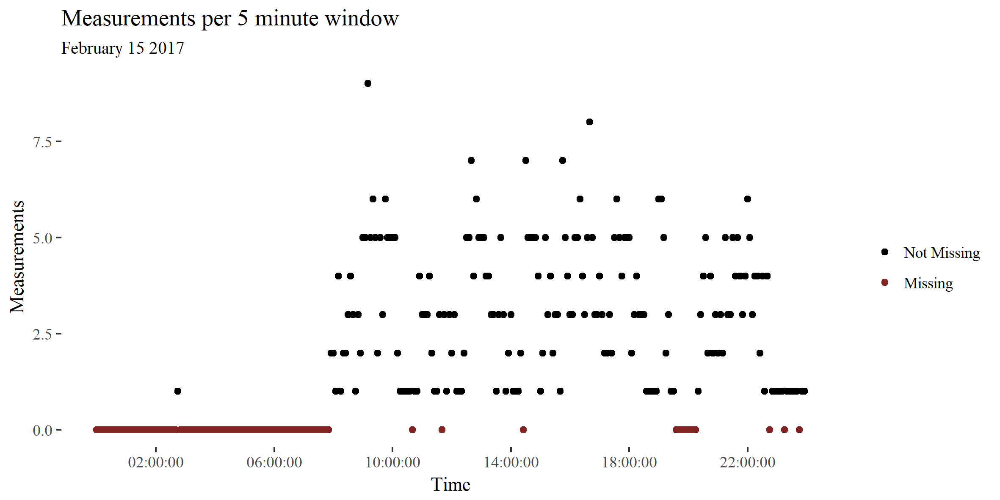

```{r setup, include=FALSE}
knitr::opts_chunk$set(echo = TRUE, cache = TRUE)
library(ggthemes)
library(ggplot2)
library(knitr)
```

# Abstract
*Using objective location data to infer the mobility measures of individuals is highly desirable, but methodologically difficult. Using commercially gathered location logs from smartphones holds great promise, as they have already been gathered, often span years and can be associated to individuals. However, due to technical constraints this data is more sparse and inaccurate than that produced by specialised equipment. In this paper we present a model which leverages the periodicity of human mobility in order to impute missing data values. Moreover, we will compare the performance of the model compared to currently used methods, such as linear interpolation.*

# Introduction

How active people are and how they interact with their environment affects a wide range of measures including health , income and social capital [@goodchild_toward_2010]. A better understanding of both within-person and between-person variability in geospatial patterns could be conducive to better social, health and urban-planning policies. Yet a large part of studies on human mobility are largely based on pen-and-paper travel diaries. These surveys have known methodological flaws, such as the short period of data collection (due to costs and burden to respondents), the underreporting of short trips [@wolf_impact_2003] and the underestimation of the duration of commutes [@delclos-alio_keeping_2017]. 

Objective data on human mobility has become available through the Global Positioning System (GPS) which uses the distance between a device and a number of satellites to determine location. Within behavioural science, this type of data has been used to investigate topics such as the effects of the food environment on eating patterns [@zenk_how_2009], the movement correlates of personality and academic performance [@harari_using_2016; @wang_smartgpa:_2015] and detecting bipolar disorder [@palmius_detecting_2017].

In most of these studies participants are given a specialised devices, resulting in accurate mobility GPS data (*specialised logs*). However, @barnett_inferring_2016 point out that these studies are not scalable due to cost and burden to participants, moreover may be biased because of the introduction of a new device to the participant's life. Because of this, specialised logs usually span a short amount of time. @barnett_inferring_2016 advocate installing custom-made tracking app on user's phones (*custom logs*). Another solution is to take advantage of existing smartphone location logs, such as Google Location History, which store location information of millions of users spanning several years [@location_history_timeline_nodate] (*secondary logs*). These logs can be accessed and shared by users. Yet, because they were created for non-academic purposes under engineering constraints, the sensors do not monitor continuously and the resulting logs can be sparse and inaccurate. Hence, two important challenges are dealing with measurement noise and missing data.

There is currently no golden standard in how to deal with missing data in custom or secondary logs [@barnett_inferring_2016]. @jankowska_framework_2015 have pointed out that there is often little transparency regarding decisions of how to deal with missing data. Methods frequently used by researchers to reduce noise, such as throwing out inaccurate measurements [e.g. @palmius_detecting_2017] can exacerbate the severity of the missing data problem. Traditional missing data methods, such as multiple imputation, cannot be used easily due to the geospatial nature of the data.  On the other hand, noisy data can lead to inaccurate conclusions if it is not accounted for, such as underestimating the movement of individuals. In this paper we will compare methods used to deal with measurement error and missing data in location information. Specifically, we are interested in establishing accurate mobility patterns from smartphone GPS logs.

# Problem description & literature review

Given that there is next to no literature on missing data in custom or secondary logs it is worth illustrating the typical characteristics of this data using an example data set. Moreover, although we could find no published papers on dealing with missing data in secondary logs, there are methods which deal with similar problems. In this section we will describe the problems with the data and why they arise as well as the models which could be applied to it.

## Location logs and notation

This example dataset comes from Google Location History and spans 3 years from January 2013 to January 2017 with multiple different Android devices. It contains 814 941 measurements, with approximately 742 measurements per day ($\widehat{\sigma}$=868.15). The dataset contains a wide range of variables. For the purposes of this paper we will focus only on latitude, longitude, accuracy and time.

Borrowing from @barnett_inferring_2016 let a persons' true Cartesian location be $G(t) = [G_x(t) G_y(t)]$ and $D \in \mathbb{R}^2$ be the recorded data containing lattitude and longitude. In addition, let $a$ denote the estimated accuracy of the recorded data.  accuracy. $G(t)$, $D$ and $a$ are indexed by the set $t_1 < ... < t_{n+1}$. For simplicity, let each entry in the discrete index set represent a 5 minute window. The measure of accuracy $a_t$ is given in meters such that it represents the radius of a 67% confidence circle. If $D_t = \emptyset$ it is considered *missing* and it is not missing otherwise. 

### Accuracy in location logs 

In professional grade GPS trackers less than 80% of measurements $D$ fall within 10 meters of the true location $G(t)$. GPS measures are reported to be most inaccurate in high density urban locations and indoors [@schipperijn_dynamic_2014;@duncan_portable_2013]. Unfortunately for social scientists, this happens to be where most people in the developed world tend to spend most of their time.

```{r, accuracyPlot,echo = FALSE,fig.cap="Measurement accuracy of each logged measurement in a morning journey. The red circles denote the accuracy of all logged measurement points (the raw data). The points connected in time are connected by a line. The blue line shows the path without the most innaccurate (accurace > 400 meters) points filtered out. The red line shows the path with all measurements included. ",out.width = '100%'}
include_graphics("img/journeyTillMiddayBoaz.png")
```

Given that Android phones collect location information from WiFi access points, cellphone triangulation, and GPS measurements due to computational and battery constraints [@lamarca_place_2005; @chen_practical_2006], the accuracy is substantially lower than in professional grade GPS trackers. Based on this data set, less than 40% of measures $D$ are paired with $a \leq 20$. @palmius_detecting_2017 note that in their custom logs inaccurate location values are interspersed between more accurate location values at higher sample rates per hour. I observe similar patterns in secondary logs. 


### Missingness

Missing data is a pervasive issue as it can arise due to multiple factors, both technical and behavioural. Technical reasons include signal loss, battery failure and device failure. Behavioural reasons include leaving the phone at home, switching the phone off, switching location measurements off, and so on. As a result, applied researchers are often left with wide temporal gaps with no measurements. For instance, different groups studying the effect of bipolar disorder on human movement have reported missing data rates between 30% to 50% [@saeb_mobile_2015;@grunerbl_smartphone-based_2015;@palmius_detecting_2017]. Similar trends are consistently reported in other fields [e.g. @harari_using_2016;@jankowska_framework_2015].


```{r, measurementsPerDay,echo = FALSE,fig.cap="Example of missing data over a day. The x-axis denotes time, the y-axis shows how many measurements are made and each point is a five minute window. For this day there were several periods with no information.",out.width = '100%'}
#fix width


```

## State of the art in spatiotemporal models

Research with respect to the analysis of GPS data is wideranging, highly interdisciplinary and serves vastly different purposes. The following section briefly illustrates some methods used to deal with measurement inaccuracy and missing data problems in spatiotemporal data, as well as their applicability to our question. Moreover, we discuss in detail two approaches which deal explicitly with missing data in smartphone measured human location.

### Spatiotemporal Imputation Methods

Given fixed measurement stations there are several imputation methods for spatiotemporal measurements. For instance, @feng_cutoff:_2014 illustrate their CUTOFF method, which relies on estimating missing values using the nearest observed neighbours in time, using rainfall data from dozens of gauging stations across Australia. Similarly, @zhang_application_2017 use a variety of machine learning methods to present their model based on underground water data in China.

While @feng_cutoff:_2014 claim their model could be used to establish mobility patterns, ostensibly by dividing the sample space into rasters analogous to measurement stations indicating a probability of the individual being there, this seems to be computationally unfeasible. To our knowledge such models have not been implemented.  

### State Space Models

There is a vast literature of using state space models (SSMs) to improve measurements accuracy and deal with missing data. Behavioural ecologists for instance, have used SSMs extensively to explain how animals interact with their environment [@patterson_statespace_2008]. These models can be quite complex, for example @preisler_modeling_2004 uses Markovian movement processes to characterise the effect of roads, food patches and streams on cyclical elk movements. The most well studied SSM is the Kalman filter, which is the optimal algorithm for inferring linear Gaussian systems. The extended Kalman filter is the de facto standard for GPS navigation [@chen_state_2013].

The advantage of state space models is that they are flexible, deal with measurement inaccuracy, include information from different sources and can be used in real time. For our purposes the main limitation is that these models are based on the Markov property. Thus, the estimated location $G(t)$ at timepoint $t$ is often based only upon measurements $D_t$, $D_{t-1}$ and ignores all $D_{t-i}|i\geq2$. This may be suitable for ships at sea, but it ignores the highly periodic nature of human movement. Hierarchical structuring and conditioning on a larger context have been suggested as ways to improve their performance, but these are often computationally intractable or unfeasible [@sadilek_far_2016].

### Alternative models

Alternatives to state space models include long range-persistence models, such as cascading walks models  and the FarOut model which rely on self-similarity and autoregressive characteristics [@han_cascading_2015; @sadilek_far_2016]. The latter uses Fourier analysis and PCA to extract cyclical patterns in an individual's behaviour and reduce the dimensionality of the extracted features and yields interpretable predictions for an individuals location months in advance. 

### Filtering & Mean imputation

@palmius_detecting_2017 deal with measuremement inaccuracy of $D$ by removing from the data set all unique low-accuracy $a$ data points that had  $\frac{d}{dt}D > 100 \frac{km}{h}$. Subsequently the researchers down sample the data to a sample rate of 12 per hour using a median filter. Moreover:

>If the standard deviation of [$D$] in both latitude and longitude within a 1 h epoch was less than 0.01 km, then all samples within the hour were set to the mean value of the recorded data, otherwise a 5 min median filter window was applied to the recorded latitude and longitude in the epoch.

Missing data was imputed using the mean of measurements close in time if the participant was recorded within 500m of either end of a missing section and the missing section had a length of $\leq 2h$ or $\leq 12h$ after 9pm. 

### Barnett's model

@barnett_inferring_2016 deal with custom logs where location is measured for 2 minutes and subsequently not measured for 10 minutes. They handle missing data by:

> simulat[ing] flights and pauses over the period of missingness where the direction,
duration, and spatial length of each flight, the fraction of flights versus the fraction of
pauses, and the duration of pauses are sampled from observed data

This method can be extended to imputing the data based on temporally, spatially or periodically close flights and pauses. In other words, for a given missing period, the individual's mobility can be estimated based on  measured movements in that area, at that point in time or movements in the last 24 hours.

This paper is to the best of our knowledge the only attempt at establishing a principled approach to this problem

## Methods

### Datasets & Analyses

The data used was collected between 2014 and 2017 on different Android devices from X individuals across X continents. The table below provides more details:

```{r datadetailsTable, echo = F}
datadetails <- readRDS("tempdata/datadetails.rds")
kable(datadetails,digits = 2,col.names = c("Log duration",
                                           "Observations",
                                           "Missing days",
                                           "Mean Accuracy",
                                           "SD Accuracy"))
```

In addition to the secondary logs, participants also volunteered to carry with them a specialised GPS tracker for week. Therefore we also used a week of parallel secondary and specialised logs.

Analyses were performed using R and a multitude of other packages [@ggplot2;@dplyr;@leaflet; @ggthemes;@base;@sp1;@sp2].

### Data pre-processing

The data was discretised into 5 minute windows following @palmius_detecting_2017 (as described above, for more detail please consult the original paper). 

### Imputation methods

Four imputation methods were selected in order to cover techniques applied in the literature. Briefly, the filtered mean imputation method described by @palmius_detecting_2017, the model developed by @barnett_inferring_2016 as well as an adapted FarOut model [@sadilek_far_2016]. Simple Kalman filtered linear interpolation was used as a benchmark models. 

### Evaluation criteria

The entire length of the secondary logs were used as a training set. The specialised logs were used as a test set. The missing data imputation models were evaluated both directly, and on on two computed measures: amount of trips made and distance traveled.

Measures of performance used were root mean square error (RMSE) and mean absolute error (MAE).

## Results


## Discussion


## References
