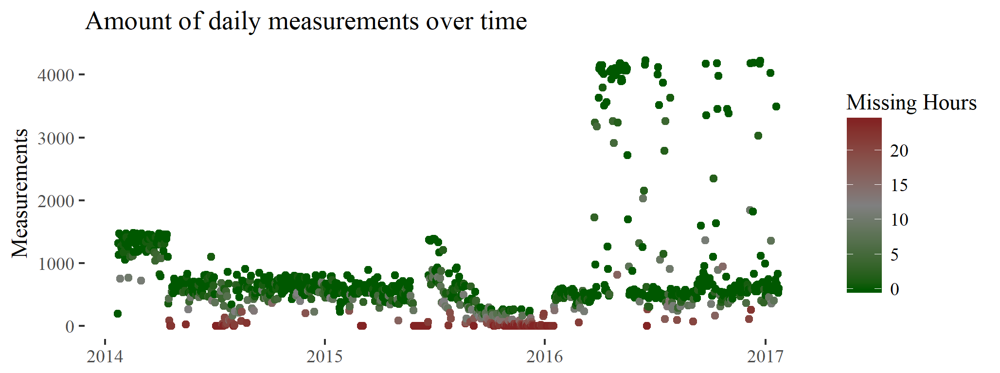

```{r setup, include=FALSE}
knitr::opts_chunk$set(echo = TRUE)
library(ggthemes)
library(ggplot2)
library(knitr)
```

# Abstract
*There is a great interest in using objective location data to quantify the mobility characteristics of individuals. However, *

# Introduction

How active people are and how they interact with their environment affects a wide range of measures including health , income and social capital [@goodchild_toward_2010]. A better understanding of both within-person and between-person variability in geospatial patterns could be conducive to better social, health and urban-planning policies. Yet a large part of studies on human mobility are largely based on pen-and-paper travel diaries. These surveys have known methodological flaws, such as the short period of data collection (due to costs and burden to respondents), the underreporting of short trips [@wolf_impact_2003] and the underestimation of the duration of commutes [@delclos-alio_keeping_2017].

Objective data on human temporospatial behaviour has become available throgh the Global Positioning System (GPS) which uses the distance between a device and a number of satellites to determine location. Within behavioural science, this type of data has been used to investigate topics such as the effects of the food environment on eating patterns [@zenk_how_2009], the movement correlates of personality and academic performance [@harari_using_2016; @wang_smartgpa:_2015] and detecting bipolar disorder [@palmius_detecting_2017]. In most of these studies participants are given a specialised GPS devices or a smartphone with a custom made app. However, @barnett_inferring_2016 point out that these studies are not scalable due to cost and burden to participants, moreover may be biased because of the introduction of a new device to the participant's life and usually span a short amount of time. A solution would be to take advantage of the location logs that smartphones already collect, such as Google Location History which stores Android phone users' locations [@location_history_timeline_nodate]. Yet, because GPS sensors consume a significant amounts of battery, these logs can be sparse and inaccurate. Hence, two important challenges are dealing with measurement noise and missing data.

Studies of professional grade GPS trackers suggest that less than 80% of measurements fall within 10 meters of the true location. Moreover, GPS measures are reported to be most inaccurate in high density urban locations and indoors [@schipperijn_dynamic_2014;@duncan_portable_2013]. Unfortunately for social scientists , this happens to be where most people in the developed world tend to spend most of their time. In addition, location data collected by more ubiquitous (but less specialised) smartphones are an amalgamation of sensor data. For instance, Android phones collect location information from WiFi access points, cellphone triangluation, and GPS measurements due to computational and battery constraints [@lamarca_place_2005;@chen_practical_2006]. This adds another layer of complexity as each of these measures has its own characteristics in terms of measurement accuracy and bias.

As for missing data it is a pervasive issue as it can arise due to multiple factors, both technical and behavioural. Technical reasons include signal loss, battery failure and device failure. Behavioural reasons include leaving the phone at home, switching the phone off, switching location tracking off, etc. As a result, applied researchers are often left with wide temporal gaps with no measurements. For instance, different groups studying the effect of bipolar disorder on human movement have reported missing data rates between 30% to 50% [@saeb_mobile_2015;@grunerbl_smartphone-based_2015;@palmius_detecting_2017]. Similar trends are consistently reported in other fields [e.g. @harari_using_2016;@jankowska_framework_2015].

There is currently no golden standard in how to deal with missing temporospatial track data [@barnett_inferring_2016]. @jankowska_framework_2015 have pointed out that there is often little transparency regarding decisions of how to deal with it. Methods frequently used by researchers to reduce noise, such as throwing out inaccurate measurements [e.g. @palmius_detecting_2017] can increase the severity of the missing data problem. On the other hand, noisy data can lead to inaccurate conclusions if it is not accounted for.

In this paper we will compare methods used to deal with measurement error and missing data in location information. Specifically, we are interested in establishing accurate mobility patterns from smartphone GPS logs.

# Problem description and literature review

## The structure of smartphone location logs

Android logged data 

```{r, measurementsPerDay,echo = FALSE,fig.cap="Missing data over time for the author. The x-axis denotes time, the y-axis shows how many measurements are made and each point is a day. The fill of the points shows the amount of hours of captured data each day.",out.width = '100%'}
# from the playingaroundwiththicken.r file
```

Linear Interpolation vs actual movement vs kalman filtered.  

## State of the art in temporospatial models

Research with respect to the analysis of GPS data is wideranging, highly interdisciplinary and often serves different purposes. Given that @barnett_inferring_2016 is to our knowledge the only paper explicitly focusing on dealing with missingness for inferring missingness using GPS data the following section briefly illustrates the some methods used to solve measurement inaccuracy and missing data problems in the field, as well as their applicability to our question.

### Spatiotemporal Imputation Methods

Given fixed measurement stations there are sevaral imputation methods for spatiotemporal measurements. For instance, @feng_cutoff:_2014 illustrate their CUTOFF method, which relies on estimating missing values using the nearest observed neighbours in time, using rainfall data from dozens of gauging stations across Australia. Similarly, @zhang_application_2017 use a variety of machine learning methods to present their model based on underground water data in China.

While @feng_cutoff:_2014 claim their model could be used to establish mobility patterns, ostentibly by dividing the sample space into rasters which would be measurement stations indicating a probability of the individual being there, this seems to be computationally unfeasible to do. To our knowledge such models have not been implemented.  

### State Space Models

There is a vast literature of using state space models (SSMs) to improve measurements accuracy and deal with missing data. Behavioural ecologists for instance, have used SSMs to explain how animals interact with their environment [@patterson_statespace_2008]. These models can be quite complex, for example @preisler_modeling_2004 uses Markovian movement processes to characterise the effect of roads, food patches and streams on cyclical elk movements. The most well studied SSM is the Kalman filter, which is the optimal algorithm for inferring linear Gaussian systems. The extended Kalman filter is the de facto standard for GPS measurements [@chen_state_2013]. 

The advantage of state space models is that they are flexible, deal with measurement inaccuracy, include information from different sources and can be used in real time. For our pourposes the main limitation is that these models are based on the Markov property. Thus, the estimated location at timepoint $k$ is often based only upon measurements at $k$ and the previous timepoint $k-1$. This assumption ignores the periodic nature of human movement, whereby people generally spend the nights at home and the day at work. Hierarchical structuring and conditioning on a larger context have been suggested as ways to improve their performance, but these are often computationally intractable or infeasible [@sadilek_far_2016].

### Alternative models

Alternatives to state space models include long range-persistence models, such as cascading walks models  and the FarOut model which rely on self-similarity and autoregressive characteristics [@han_cascading_2015; @sadilek_far_2016]. The latter uses Fourier analysis and PCA to extract cyclical patterns in an individual's behaviour and reduce the dimensionality of the extracted features and yields interpretable predictions for an individuals location months in advance. 

## Methods

*An asside as to my conversation with Peter on 07.11*

We can get some trackers on people to measure movement constantly and be a "golden standard" to evaluate the models.

For December, it would be nice to have the Lit Rev section, plus an exploration of the problem. 

### Data & Analyses

The data used was collected between 2014 and 2017 on different Android devices. A total of X individuals contributed to the analysis, yielding a total of Y data points. Moreover we used diary information from **SOMEWHERE**.

Analyses were performed using R and a multitude of other packages (@ggplot2 @dplyr @leaflet @sp @ggthemes @base @sp1 @sp2).

*Plots: data points over time*


#### Filtering

*Carlson et al 2015* describe a personal activity measurement system (PALMS), which can filter data points (among others). Their system is validated using cameras.

Like others (e.g. @palmius_detecting_2017) they detect invalid points using extreme speed.

*Google* offers an out of the box activity inferral mechanism.

### Discussion on missing data

Our missing data patterns fit the broader pattern of missing data reported by others [@palmius_detecting_2017;@saeb_mobile_2015; @grunerbl_smartphone-based_2015;@harari_using_2016]. 

Missing data can  Importantly, one cannot say that the data is missing at random as there are a myriad of reasons why missingness can be related to location, such as turning off the phone on the plane before a long flight.

```{r missingDataPlot,echo = FALSE,fig.cap="Missing data over time for the author. The x-axis denotes time, the y-axis shows how many measurements are made on each day. The fill of the points shows the amount of hours of captured data each day.",fig.height=5}

### Models

#### Spatiotemporal imputation methods


## Results

## Discussion

## References