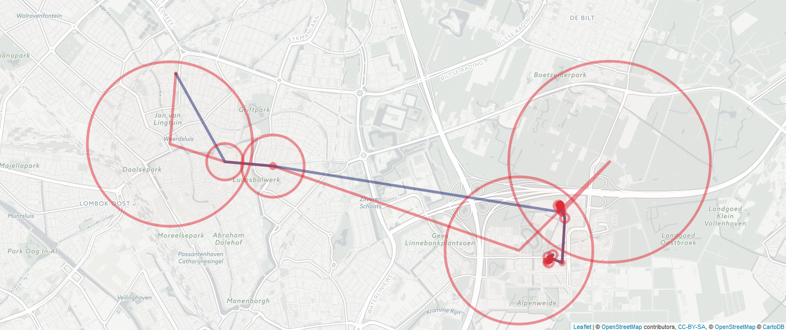
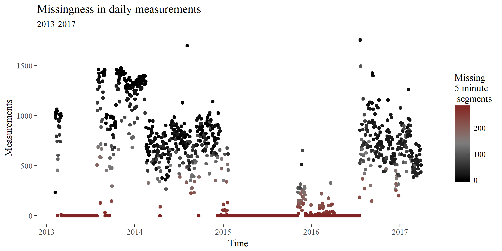

```{r setup, include=FALSE}
knitr::opts_chunk$set(echo = TRUE, cache = TRUE)
library(ggthemes)
library(ggplot2)
library(knitr)
```

# Abstract
*Using objective location data to infer the mobility measures of individuals is highly desirable, but methodologically difficult. Using commercially gathered location logs from smartphones holds great promise, as they have already been gathered, often span years and can be associated to individuals. However, due to technical constraints this data is more sparse and inaccurate than that produced by specialised equipment. In this paper we present a model which leverages the periodicity of human mobility in order to impute missing data values. Moreover, we will assess the performance of the model relative to currently used methods, such as linear interpolation.*

# Introduction

How people move about in their environment affects a wide range of outcomes. These include health, income and social capital [@goodchild_toward_2010]. A better understanding of mobility could lead to better health and urban-planning policies. A large part of studies on human mobility are conducted with pen-and-paper travel diaries. These surveys have known methodological flaws. The high cost and burden to respondents limits the period of data collection. Short trips are often under reported  [@wolf_impact_2003] . The self-reported duration of commutes is often underestimated [@delclos-alio_keeping_2017]. 

These obstacles can be overcome by using objective data on human mobility. Such data  can now be obtained using the Global Positioning System (GPS). GPS uses the distance between a device and several satellites to determine location. Within behavioural sciences, researchers have used GPS data to investigate wideranging topics. For example,  @zenk_how_2009 investigate the effects of the food environment on eating patterns. @harari_using_2016 look at the movement correlates of personality.  @wang_smartgpa:_2015  does the same for academic performance.  @palmius_detecting_2017 use mobility patterns to predict bipolar depression.

In most studies participants receive a specialised GPS devices to track their mobility.  We call resulting logs *specialised logs*. @barnett_inferring_2016 point out several methodological issues with these studies. High costs and a high burden to participants limits their scalability. Besides, introducing a new device to the participant's life may bias the data. Due to these drawbacks specialised logs usually span a short amount of time. @barnett_inferring_2016 advocate installing a custom-made tracking app on user's phones (*custom logs*). Another solution is to take advantage of existing smartphone location logs  (*secondary logs*) . For instance,  Google Location History contains information on millions of users [@location_history_timeline_2017]. Often, secondary logs span several years. By law, secondary logs are accessible to users for free [@commission_protecting_2017]. Yet, secondary logs also present methodological challenges. They were created for non-academic purposes under engineering constraints. These constraints mean that sensors do not track users continuously. The resulting logs can be sparse and inaccurate. Hence, two important challenges are dealing with measurement noise and missing data.

Missing data is a pervasive issue as it can arise due to several reasons. Technical reasons include signal loss, battery failure and device failure. Behavioural reasons include leaving the phone at home or switching the device off. As a result, secondary logs often contain wide temporal gaps with no measurements. For instance, several research groups studying mental health report missing data rates between 30% to 50% [@saeb_mobile_2015;@grunerbl_smartphone-based_2015;@palmius_detecting_2017]. Other researchers report similar trends in other fields [e.g. @harari_using_2016;@jankowska_framework_2015].

There is no golden standard for dealing with missing data in GPS logs [@barnett_inferring_2016]. Traditional methods, such as mean imputation, are not suitable for spatiotemporal data. This is because measurements are often correlated in time and space. For example, imagine an individual who splits almost all her time between work or at home. Suppose she spends a small amount of time commuting between the two along a circular path. Using mean imputation to estimate her missing coordinates, we impute her to be at the midpoint between home and work.  She has never and will never be there! Worryingly, there is little transparency on how researchers deal with missing data [ @jankowska_framework_2015].

Smartphone location measurements are substantially less accurate than those of professional GPS trackers. Android phones collect location information through a variety of less accurate methods. Other than GPS measurements, Androids use WiFi access points and cellphone triangulation. Different methods are used because of computational and battery constraints [@lamarca_place_2005; @chen_practical_2006]. In professional GPS trackers less than 80% of measurements fall within 10 meters of the true location. GPS measures are most inaccurate in dense urban locations and indoors [@schipperijn_dynamic_2014;@duncan_portable_2013]. Unfortunately for researchers, this is where people in the developed world spend most of their time.

Noisy data can lead to inaccurate conclusions if it is not accounted for. Suppose we wish to calculate an individual's movement in a day. A simple approach would be to calculate the sum of the distance between each measurement. But if there is noise, the coordinates will vary even though the individual is not moving. If the measurements are frequent and noisy, we will calculate a lot of movement. Even if the individual did not move at all! The problem is further complicated because missing data and noisy measurements are related. Methods used by researchers to reduce noise, such as throwing out inaccurate measurements [e.g. @palmius_detecting_2017],  can exacerbate the severity of the missing data problem.

In this paper we will compare methods used to deal with measurement error and missing data in mobility patterns from secondary GPS logs.

# A concrete example

Given that there is little literature on dealing with missing data in custom or secondary logs it is worth illustrating the typical characteristics of this data using an example data set. The example dataset comes from the Google Location History of a single individual and spans from January 2013 to January 2017. It was recorded with multiple different Android devices and contains 814 941 measurements, with approximately 742 measurements per day ($\widehat{\sigma}$=868.15). The dataset contains a wide range of variables including inferred activity and velocity. For the purposes of this paper we will focus only on latitude, longitude, accuracy (defined below) and a timestamp.

## Location logs and notation

GPS measurements report our location on a three dimensional planet, yet we are interested in placing these measurements on a two dimensional map. Projecting three dimensional measurements onto a two dimensional plane results in errors, in order to minimise these errors we borrow an error minimising projection method from @barnett_inferring_2016. 

Let a persons' true location on this two-dimensional plane be $G(t) = [G_x(t) G_y(t)]$ where $G_x(t)$ and $G_y(t)$ denote the location of the individual at time $t$ on the x-axis and y-axis respectively. Moreover, let $D \in \mathbb{R}^2$ be the recorded data containing lattitude and longitude. In addition, let $a$ denote the estimated accuracy of the recorded data.  accuracy. $G(t)$, $D$ and $a$ are indexed by time labled by the set $T = t_1 < ... < t_{n+1}$. For simplicity, let each entry in the discrete index set $T$ represent a 5 minute window. The measure of accuracy $a_t$ is given in meters such that it represents the radius of a 67% confidence circle. If $D_t = \emptyset$ it is considered *missing* and it is not missing otherwise. 

### Accuracy in location logs 

In the example data set the distribution of $a$ is highly right skewed, with a median of 28, $\mu = 127$ and the maximum value at 26 km. @palmius_detecting_2017 note that in their Android based custom logs inaccurate location values are interspersed between more accurate location values at higher sample rates per hour. We observe similar patterns in secondary logs. Figure 1 shows how accuracy can vary as a function of user behaviour, time and location. Inaccurate measures are often followed by more accurate measures.  Most notably, low accuracy often (but not always) is  associated with movement (Figure 2). Stationary accuracy varies depending on phone battery level, wifi connection and user phone use. There are several recurring low-accuracy points, possibly the result of cell-phone tower triangulation. 

```{r, accuracyPlot,echo = FALSE,fig.cap="Measurement accuracy of each logged measurement on a morning journey. The red circles denote the accuracy of all logged measurement points (the raw data). The points connected in time are connected by a line. The blue line shows the path without the most inaccurate (accuracy > 400 meters) points filtered out. The red line shows the path with all measurements included. ",out.width = '100%'}

```


```{r, accuracyPlot2, echo=FALSE, fig.cap="The upper chart shows the rolling mean distance from the next point in meters over the course of the day. The lower chart shows the rolling mean accuracy over the course of the day. In both cases, the rolling window is 3.",out.width = '100%'}
include_graphics("img/accuracyLocShift.png")

```

### Missingness

Over 54% of the data is missing for the entire duration of the log (as shown in Figure X a). However,this is misleading as there are several long periods with no measurements whatsoever. The structure of missingness of a day with measurements is shown in Figure X b. As you can see, there are several long periods over the course of the log for which there are no measurements. Moreover, even during a single day there are continuous periods where there is missing data, mostly during the late hours of the night in this case. 

```{r, longMeasurementsPerDay,echo = FALSE,fig.cap="Example of missing data over the entire duration of the log. The x-axis denotes time, the y-axis shows how many measurements are made and each point is a five minute window. For this day there were several periods with no information. These points are filled with red and lie on the x-axis.",out.width = '100%'}



```

```{r, measurementsPerDay,echo = FALSE,fig.cap="Example of missing data over a day. The x-axis denotes time, the y-axis shows how many measurements are made and each point is a five minute window. For this day there were several periods with no information. These points are filled with red and lie on the x-axis.",out.width = '100%'}
#fix width
include_graphics("img/missingBoaz5minExample.png")
```

## Current methods for imputing missing spatiotemporal data

As we have mentioned before, @jankowska_framework_2015 point out that there is little transparency regarding decisions of how to deal with missing data in GPS mobility logs. We suspect this is because the highly interdisciplinary nature of the problem means researchers are unaware of potential solutions. For this reason, we consider it important to briefly discuss a few methods one could consider in order to deal with measurement inaccuracy and missing data problems in spatiotemporal data. In doing so, we will argue that state space models (SSMs) and spatiotemporal imputation methods, which are extensively used to model missing and noisy spatiotemporal data, are not well suited to deal with human mobility patterns. Moreover, we discuss in detail two approaches by @palmius_detecting_2017 and @barnett_inferring_2016 which deal explicitly with missing data in mobility patterns from smartphone GPS logs.

There is a vast literature of using SSMs to improve measurements accuracy and deal with missing data. Behavioural ecologists for instance, have used SSMs extensively to explain how animals interact with their environment [@patterson_statespace_2008]. These models can be quite complex, for example @preisler_modeling_2004 uses Markovian movement processes to characterise the effect of roads, food patches and streams on cyclical elk movements. The most well studied SSM is the Kalman filter, which is the optimal algorithm for inferring linear Gaussian systems. In fact, the extended Kalman filter is the de facto standard for GPS navigation [@chen_state_2013]. The advantage of state space models is that they are flexible, deal with measurement inaccuracy, include information from different sources and can be used in real time.

However, the main limitation of SSMs is that they ignore the fact that humans have regular movement routines, such as going to work or shopping for groceries on weekends. This limitation is due to the fact that SSMs are based on the Markov property. Thus, the estimated location $G(t)$ at timepoint $t$ is often based only upon measurements $D_t$, $D_{t-1}$ and ignores all $D_{t-i}|i\geq2$. Hierarchical structuring and conditioning on a larger context have been suggested as ways to improve the performance of Markovian models, but these solutions are often computationally intractable or unfeasible [@sadilek_far_2016]. For this reason we do not consider SSMs to be useful for imputing missing data, although they could be of use in filtering noise.

In addition to SSMs there are spatiotemporal imputation methods often used in climate or geological research for estimating missing data. For instance, @feng_cutoff:_2014 illustrate their CUTOFF method, which relies on estimating missing values using the nearest observed neighbours in time, using rainfall data from dozens of gauging stations across Australia. Similarly, @zhang_application_2017 use a variety of machine learning methods to present their model based on underground water data in China.

The difficulty of applying this class of spatiotemporal imputation models to human mobility tracks lies in the fact that these models generally assume fixed measurement stations (such as rainfall gauging stations). While @feng_cutoff:_2014 claim their model could be used to establish mobility patterns, ostensibly by dividing the sample space into rasters analogous to measurement stations indicating a probability of the individual being there, this seems to be computationally unfeasible. To our knowledge such models have not been implemented for mobility traces.

On the other hand, a few researchers have explicitly attempted to impute missing data from human mobility patterns. @palmius_detecting_2017 deal with the measuremement inaccuracy of $D$ in custom logs by removing from the data set all unique low-accuracy $a$ data points that had  $\frac{d}{dt}D > 100 \frac{km}{h}$. Subsequently the researchers down sample the data to a sample rate of 12 per hour using a median filter. Moreover, @palmius_detecting_2017 explain:

>"If the standard deviation of [$D$] in both latitude and longitude within a 1 h epoch was less than 0.01 km, then all samples within the hour were set to the mean value of the recorded data, otherwise a 5 min median filter window was applied to the recorded latitude and longitude in the epoch".

Missing data was imputed using the mean of measurements close in time if the participant was recorded within 500m of either end of a missing section and the missing section had a length of $\leq 2h$ or $\leq 12h$ after 9pm. 

@barnett_inferring_2016 follow a different approach which is, to the best of our knowledge, the only pricipled approach to dealing with missing data in human mobility data. @barnett_inferring_2016 work with custom logs where location is measured for 2 minutes and subsequently not measured for 10 minutes. In the words of the authors, @barnett_inferring_2016 handle missing data by:

> "simulat[ing] flights and pauses over the period of missingness where the direction,
duration, and spatial length of each flight, the fraction of flights versus the fraction of
pauses, and the duration of pauses are sampled from observed data."

This method can be extended to imputing the data based on temporally, spatially or periodically close flights and pauses. In other words, for a given missing period, the individual's mobility can be estimated based on measured movements in that area, at that point in time or movements in the last 24 hours (*circadian proximity*).

## Methods

### Datasets & Analyses

The data used to train the imputation methods was collected between 2013 and 2017 on different Android devices from several individuals (table 1).

```{r datadetailsTable, echo = F}
datadetails <- readRDS("tempdata/datadescriptives.rds")
datadetails <- datadetails[,-7] #remove last column for now
kable(datadetails,digits = 2,col.names = c("Log duration",
                                           "Logged days",
                                           "Observations",
                                           "Missing days",
                                           "Missing data",
                                           "Mean Accuracy"),
      caption = "Table with descriptives about the data sets used to build the imputation methods. ")
```

In addition to the secondary logs, participants also volunteered to carry with them a specialised GPS tracker for a week. This specialised log was used to evaluate the models. 

Analyses were performed using R and a multitude of other statistical packages [@ggplot2;@dplyr;@leaflet;@base;@sp1;@sp2].

### Data pre-processing & filtering

The goal of filtering was to remove noise from the measurements and to aggregate multiple measurements into 12 per hour. Three different filtering methods were tested:

1. The filtered rolling-median downsampling method described by @palmius_detecting_2017.
2. A weighted mean approach taking $f(a)$ as a weight.
3. A Kalman filter commonly used for GPS measurements [@doust_smoothing_2013].

The output of all of these methods was taken as the input of the imputation methods.

### Imputation methods

Three imputation methods were selected in order to cover a wide range of techniques applied in the literature:

1. Mean imputation as described by @palmius_detecting_2017.
2. The model developed by @barnett_inferring_2016 using both spatial and temporal proximity.
3. Simple linear interpolation was used as a benchmark model.
 
### Evaluation criteria

The entire length of the secondary logs were used as a training set. The specialised logs were used as a test set. The missing data imputation models were evaluated both directly, and on two computed measures: amount of trips made and distance traveled.

The direct evaluation involved calculating the error of each $D_t$ compared to $G(t)$ approximated by the specialised log. The error measures used were root mean square error (RMSE) and mean absolute error (MAE).

The evaluation on computed measures involved calculating a mobility trace following the rectangular method of @rhee_human_2007 for each imputed dataset. Like @barnett_inferring_2016 we calculate bias by substracting the estimated measure under each approach for the same measure calculated on the full data. For simulation-based imputation approaches a mean value over 100 samples was taken.

Each imputation method used each of the three filtering methods as an input. Thus in the end we end up with eight methods to evaluate, three for each filtering method as well as four for each imputation method.

## References
